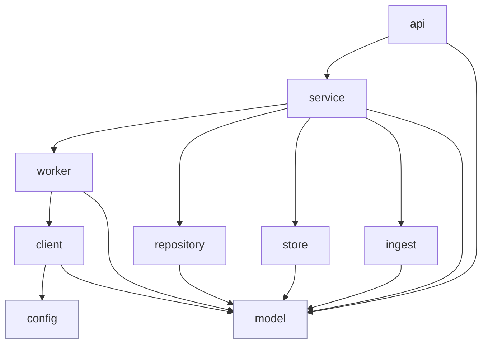
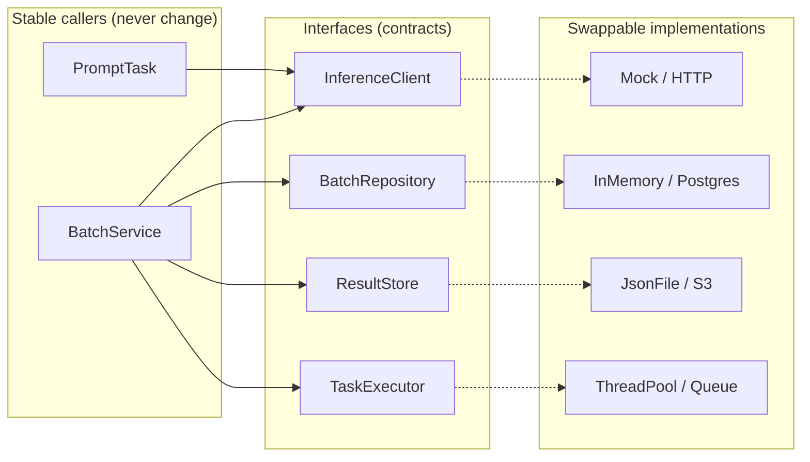
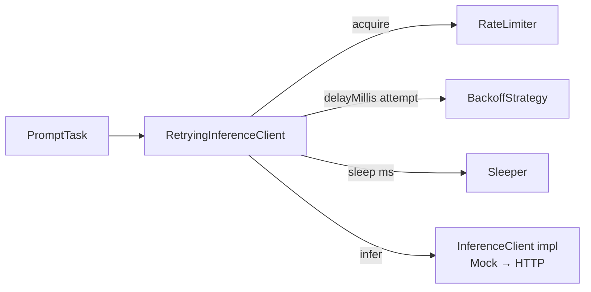
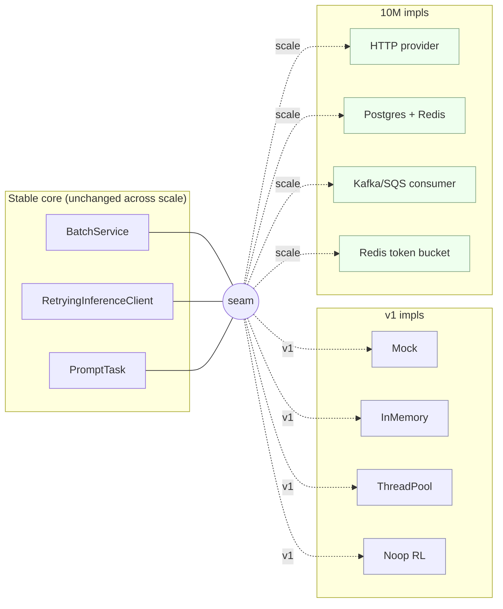
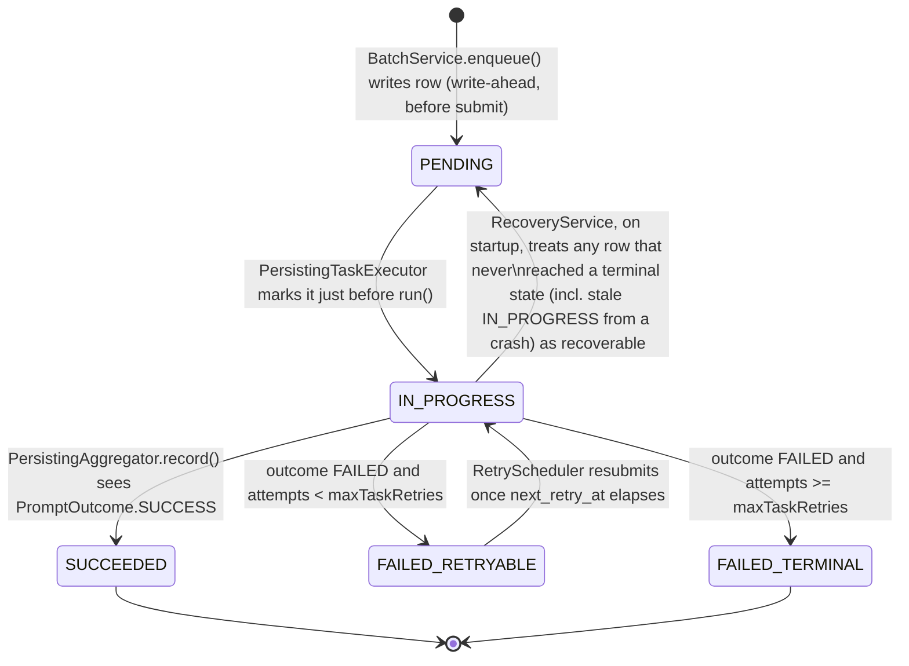
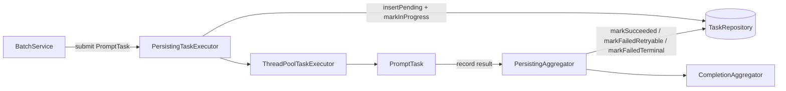
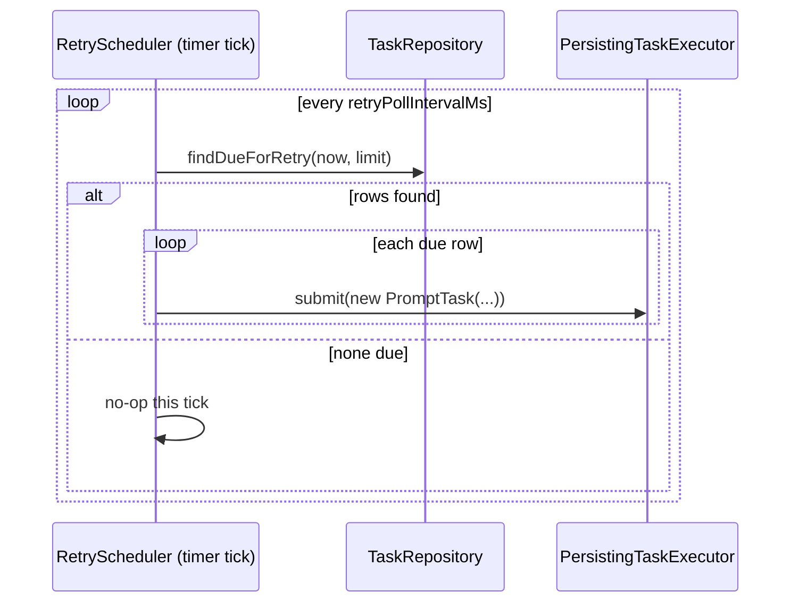

# Low-Level Design — Prompt Batch Service

> **Purpose.** This is the **engineering contract** for the service. Where
> [`SOLUTIONING.md`](SOLUTIONING.md) explains *why* the design is shaped this way (HLD +
> scaling story) and [`DEVELOPMENT_GUIDE.md`](DEVELOPMENT_GUIDE.md) walks you through
> *building it milestone-by-milestone*, this document defines *the seams*: the exact
> interfaces, class responsibilities, threading rules, and error contracts — and, most
> importantly, **the extension points you plug into when you add features or scale.**
>
> **Design goal of this document:** you should be able to add a new inference transport,
> swap the persistence backend, change the backoff algorithm, add an ingestion format, or
> move from a single node to a distributed fleet **without editing existing classes** —
> only adding new ones behind a stable interface. Every section is written with that
> "open for extension, closed for modification" lens.

---

## Table of contents

1. [How to read this document](#1-how-to-read-this-document)
2. [Design principles (the rules we don't break)](#2-design-principles-the-rules-we-dont-break)
3. [Module & dependency architecture](#3-module--dependency-architecture)
4. [The seam map: core abstractions at a glance](#4-the-seam-map-core-abstractions-at-a-glance)
5. [Detailed component design](#5-detailed-component-design)
   - [5.1 `model` — domain types](#51-model--domain-types)
   - [5.2 `config` — typed configuration](#52-config--typed-configuration)
   - [5.3 `ingest` — turning input into prompts](#53-ingest--turning-input-into-prompts)
   - [5.4 `client` — inference transport + resilience](#54-client--inference-transport--resilience)
   - [5.5 `worker` — bounded concurrency](#55-worker--bounded-concurrency)
   - [5.6 `repository` + `store` — state & results](#56-repository--store--state--results)
   - [5.7 `service` — orchestration & aggregation](#57-service--orchestration--aggregation)
   - [5.8 `api` — the HTTP edge](#58-api--the-http-edge)
6. [Concurrency & thread-safety contracts](#6-concurrency--thread-safety-contracts)
7. [Error handling taxonomy](#7-error-handling-taxonomy)
8. [Composition root & dependency injection](#8-composition-root--dependency-injection)
9. [Extensibility playbook — "How do I…?"](#9-extensibility-playbook--how-do-i)
10. [Scalability seams (single node → 10M users)](#10-scalability-seams-single-node--10m-users)
11. [Design patterns used & why](#11-design-patterns-used--why)
12. [Extension-point registry (cheat sheet)](#12-extension-point-registry-cheat-sheet)
13. [Task persistence & retry (in-memory v1, DB-swappable)](#13-task-persistence--retry-in-memory-v1-db-swappable)

---

## 1. How to read this document

| If you want to… | Read |
|-----------------|------|
| Understand the problem & the big-picture design | [`SOLUTIONING.md`](SOLUTIONING.md) |
| See the alternatives considered & why we chose each approach | [`APPROACHES.md`](APPROACHES.md) |
| Build the service from the skeleton, step by step | [`DEVELOPMENT_GUIDE.md`](DEVELOPMENT_GUIDE.md) |
| Know the exact interface a class must honor | §5 of this doc |
| Add a feature or a new backend without breaking things | §9 (playbook) + §12 (cheat sheet) |
| See how each piece is swapped when scaling | §10 |

Everything lives under the base package `com.example.promptbatch`. Code shown here is the
**contract shape** (signatures, invariants), not necessarily the full body — the bodies are
in `DEVELOPMENT_GUIDE.md`.

---

## 2. Design principles (the rules we don't break)

These principles are what make the design extensible. Every review question ("where does
this new code go?") is answered by them.

1. **Program to interfaces, not implementations.** Every component that has *more than one
   possible realization now or later* is fronted by an interface: the inference transport,
   the backoff strategy, the batch store, the result store, the prompt parser, the task
   executor. Callers depend only on the interface.
2. **Open/Closed.** New behavior arrives as a **new class implementing an existing
   interface**, wired in at the composition root — *not* as an `if/else` branch inside an
   existing class. If you find yourself editing a `switch` on a "type", you probably want a
   new implementation + a factory instead.
3. **Dependency Rule (one direction).** Dependencies point **downward and inward**:
   `api → service → worker → client`; everyone may use `model` and `config`; **nobody
   depends on `api`.** No cycles. This keeps every layer independently testable and
   replaceable.
4. **Single Responsibility per layer.** HTTP concerns live only in `api`; retry/HTTP details
   live only in `client`; concurrency lives only in `worker`; persistence lives only in
   `repository`/`store`. A change in one concern touches one package.
5. **Composition over inheritance.** Resilience is added by **decorating** a transport, not
   by subclassing it. Behavior is assembled at wiring time.
6. **Ambient concerns are injected, never hard-coded.** Time (`Clock`), sleeping
   (`Sleeper`), randomness (`Random`), and id generation (`IdGenerator`) are injected so
   behavior is deterministic in tests and swappable in production.
7. **Fail a prompt, never the batch.** Errors are values (`PromptResult.failure(...)`), not
   escaping exceptions, once inside a worker. Partial failure is a first-class outcome.
8. **Bounded everything.** Threads, queues, retries, and delays all have explicit ceilings
   from config. There is no unbounded growth anywhere.

> **The extensibility test:** before adding code, ask *"which interface does this vary?"* If
> the answer is "a new one," add the interface. If "an existing one," add an implementation.
> You should almost never modify an existing concrete class to add a capability.

---

## 3. Module & dependency architecture

### 3.1 Packages and the dependency rule

```
com.example.promptbatch
│
├── api/            HTTP edge (Jersey resources + DTOs).           depends → service, model
│   └── dto/
├── service/        Orchestration + aggregation (the brains).      depends → worker, client, repository, store, model
├── worker/         Bounded concurrency (pool + task).             depends → client, service(Aggregator via iface), model
├── client/         Inference transport + retry/backoff.           depends → model, config
├── ingest/         Input → List<Prompt> parsing (SPI).            depends → model
├── repository/     Batch state storage (SPI).                     depends → model
├── store/          Result persistence (SPI).                      depends → model
├── config/         Typed config blocks.                           depends → (nothing internal)
├── model/          Domain types (POJOs/records/enums).            depends → (nothing internal)
├── health/         Health checks.                                 depends → worker, client
├── exception/      Typed errors + JAX-RS mappers.                 depends → model
└── PromptBatchApplication / PromptBatchConfiguration  (composition root)
```

**The only allowed dependency directions** (enforce with review, or ArchUnit later):



**Why this matters for extension:** because `service` depends on the *interfaces* in
`client`/`repository`/`store`/`ingest` (not their implementations), you can drop in a new
implementation of any of them and the entire upstream stack is unchanged. `model` and
`config` are dependency sinks (leaves), so they're safe to reuse everywhere.

### 3.2 Where a new concern goes

| New concern | Package | Mechanism |
|-------------|---------|-----------|
| New way to *call inference* (real HTTP, gRPC, another mock) | `client` | new `InferenceClient` impl |
| New *resilience* behavior (different backoff, circuit breaker) | `client` | new decorator / `BackoffStrategy` |
| New *input format* (CSV, multipart file, S3 pointer) | `ingest` | new `PromptSource` impl |
| New *state store* (SQLite, Postgres, Redis) | `repository` | new `BatchRepository` impl |
| New *result sink* (JSON file, S3, DB table) | `store` | new `ResultStore` impl |
| New *endpoint* | `api` | new method on a resource / new resource class |
| New *execution model* (virtual threads, distributed queue) | `worker` | new `TaskExecutor` impl |

---

## 4. The seam map: core abstractions at a glance

These are the interfaces that make the system pluggable. **This table is the heart of the
LLD** — memorize these seven seams and you understand where every future change lands.

| # | Seam (interface) | Package | Responsibility | v1 implementation | Scales to (§10) |
|---|------------------|---------|----------------|-------------------|-----------------|
| S1 | `InferenceClient` | `client` | Perform one inference call | `MockInferenceClient` | `HttpInferenceClient` (real provider) |
| S2 | `BackoffStrategy` | `client` | Compute the delay before retry *N* | `ExponentialJitterBackoff` | `RetryAfterAwareBackoff`, delay-requeue |
| S3 | `PromptSource` | `ingest` | Turn raw input into `List<Prompt>` | `JsonPromptSource`, `LinePromptSource` | `CsvPromptSource`, `S3PointerSource` |
| S4 | `BatchRepository` | `repository` | Own batch state & lookup | `InMemoryBatchRepository` | `PostgresBatchRepository` + Redis counters |
| S5 | `ResultStore` | `store` | Persist per-prompt / aggregated results | `InMemoryResultStore`, `JsonFileResultStore` | `S3ResultStore` + DB index |
| S6 | `TaskExecutor` | `worker` | Run bounded units of work | `ThreadPoolTaskExecutor` | `QueueTaskExecutor` (Kafka/SQS consumer) |
| S7 | `RateLimiter` | `client` | Gate the *offered* request rate | `NoopRateLimiter` / `LocalRateLimiter` | `RedisTokenBucketRateLimiter` |
| S8 | `TaskRepository` | `repository` | Log per-task lifecycle for crash/idle retry | `InMemoryTaskRepository` | `SqliteTaskRepository` / `PostgresTaskRepository` (§13) |

Every seam follows the same rule: **the caller holds the interface; the composition root
chooses the implementation.** Adding S7 (`RateLimiter`) as a no-op in v1 means the seam
already exists for the distributed token bucket at scale — *no caller changes when it becomes
real*.



---

## 5. Detailed component design

Each component below documents: **contract** (interface/shape), **responsibilities**,
**collaborators**, **thread-safety**, **invariants**, and **extension notes**.

### 5.1 `model` — domain types

Pure data. No behavior that reaches out to other layers. Shared instances must be
thread-safe (see §6).

```java
public enum BatchStatus { QUEUED, PROCESSING, COMPLETED, FAILED }
public enum PromptOutcome { SUCCESS, FAILED }

public record Prompt(String id, String text) {}

public record PromptResult(String promptId, PromptOutcome outcome,
                           String output, String failureReason, int attempts) {
    public static PromptResult success(String id, String out, int attempts) { ... }
    public static PromptResult failure(String id, String reason, int attempts) { ... }
}
```

`Batch` is the one **mutable, shared** model type; its state transitions and counters are
atomic (full contract in §6 and in `DEVELOPMENT_GUIDE.md` §4).

**Invariants:**
- `completed == succeeded + failed` at all times.
- `status` moves only `QUEUED → PROCESSING → {COMPLETED|FAILED}` (monotonic; no back-transitions).
- `finishedAt` is set exactly once (compare-and-set).

**Extension note:** add fields (e.g. `idempotencyKey`, `submittedBy`) here without touching
other layers — model is a leaf. Prefer records for new value types so they're immutable by default.

### 5.2 `config` — typed configuration

One small class per concern; all bound from `config.yml` and validated. Concurrency, retry,
and endpoint knobs are **never** literals in code.

```java
public class WorkerPoolConfig { int getSize(); int getQueueCapacity(); }
public class RetryConfig      { int getMaxRetries(); long getBaseDelayMs();
                                long getMaxDelayMs(); boolean isJitter(); }
public class MockEndpointConfig { double getRateLimitProbability(); long getBaseLatencyMs(); }
```

**Extension note:** a new tunable is a new field on the relevant config class (+ a line in
`config.yml`). If a whole new subsystem arrives (e.g. `redis:`), add a new `*Config` class and
a getter on `PromptBatchConfiguration`. Validation annotations (`@Min`, `@NotNull`) keep bad
config from booting.

### 5.3 `ingest` — turning input into prompts

**Why this is its own seam:** the brief allows *file upload OR JSON*. Rather than branch on
content type inside the resource, each input format is a `PromptSource`. Adding CSV or a
"pointer to S3" later is a new class, not an edit.

```java
// ingest/PromptSource.java
public interface PromptSource {
    /** Parse a raw payload into prompts. Assigns stable prompt ids under the batch. */
    List<Prompt> parse(String batchId, InputStream raw) throws BadInputException;

    /** Media types / formats this source can handle (used by the registry to select one). */
    boolean supports(String contentType);
}
```

v1 implementations: `JsonPromptSource` (`{"prompts":[...]}`), `LinePromptSource`
(one-prompt-per-line upload). A tiny `PromptSourceRegistry` selects by content type:

```java
public class PromptSourceRegistry {
    private final List<PromptSource> sources;      // injected; ordered
    public PromptSource select(String contentType) { /* first supports() wins */ }
}
```

**Extension note:** register a new `PromptSource` in the composition root; the resource and
service are untouched. This is a textbook **Strategy + Registry** — the open/closed poster
child.

### 5.4 `client` — inference transport + resilience

The most-scrutinized area. Three collaborating abstractions keep it clean and swappable.

```java
// client/InferenceClient.java  — S1: the transport contract
public interface InferenceClient {
    InferenceResponse infer(Prompt prompt);   // throws RateLimitedException / RetryableException
}

// client/BackoffStrategy.java  — S2: pure function, trivially unit-testable
public interface BackoffStrategy {
    long delayMillis(int attempt);            // no sleeping here; just the number
}

// client/RateLimiter.java  — S7: gate the offered rate (no-op in v1)
public interface RateLimiter {
    void acquire();                            // blocks/returns when a slot is available
}

// client/Sleeper.java  — ambient, injected for deterministic tests
@FunctionalInterface public interface Sleeper { void sleep(long ms) throws InterruptedException; Sleeper REAL = Thread::sleep; }
```

**Composition (the decorator chain):**

```
BatchService  ─uses→  InferenceClient
                         └── RetryingInferenceClient   (adds retry + backoff, uses BackoffStrategy + Sleeper + RateLimiter)
                               └── MockInferenceClient  (the raw transport)   ← swap for HttpInferenceClient
```

- **`RetryingInferenceClient` is a decorator** implementing `InferenceClient` and wrapping
  another `InferenceClient`. It owns the retry *loop* but delegates the *delay math* to a
  `BackoffStrategy` and the *waiting* to a `Sleeper`. This split means you can change the
  algorithm (S2) without touching the loop, and test the loop without real time.
- **`ExponentialJitterBackoff`** implements S2: `min(base·2^attempt, maxDelay)` then full
  jitter. Swappable for `DecorrelatedJitterBackoff`, `ConstantBackoff`, or a
  `RetryAfterAwareBackoff` that honors the server header.
- **`RateLimiter`** is called once before each attempt. v1 wires `NoopRateLimiter`; at scale
  the *same call site* uses `RedisTokenBucketRateLimiter` (§10) — zero caller change.



**Contract details:**
- `infer` returns on first success; on `RateLimitedException`/retryable error it consults
  `BackoffStrategy`, `Sleeper.sleep`s, and retries up to `maxRetries`; on exhaustion it throws
  a typed `RateLimitedException("retries exhausted…")`.
- Non-retryable errors (4xx-style) throw immediately — they are *not* retried.
- Interruption during sleep restores the interrupt flag and aborts (§7).

**Extension note (add a circuit breaker):** write `CircuitBreakingInferenceClient implements
InferenceClient` wrapping the chain, and insert it in the composition root. No existing class
changes. Because each layer *is* an `InferenceClient`, the chain composes to any depth.

### 5.5 `worker` — bounded concurrency

```java
// worker/TaskExecutor.java  — S6: abstracts "how work runs"
public interface TaskExecutor extends io.dropwizard.lifecycle.Managed {
    void submit(Runnable task);   // may apply backpressure; never spawns unbounded threads
    int activeCount();
    int queueSize();
}
```

- **`ThreadPoolTaskExecutor`** (v1) wraps a fixed-size `ThreadPoolExecutor` with a **bounded**
  `ArrayBlockingQueue` and `CallerRunsPolicy` (backpressure). `implements Managed` → graceful
  drain on shutdown. This is the exact concurrency discipline from `SOLUTIONING.md` §4.3.
- **`PromptTask implements Runnable`** is the unit of work: call `InferenceClient` → build a
  `PromptResult` → hand it to the `Aggregator`. **It never throws out of `run()`** — every
  failure becomes a `FAILED` result.

**Why `TaskExecutor` is an interface:** at scale the executor becomes a queue consumer
(`QueueTaskExecutor` reading Kafka/SQS) whose *per-pod* engine is still the bounded thread
pool. `BatchService` submits work the same way in both worlds (§10).

**Invariant:** at most `WorkerPoolConfig.size` prompts are in flight per process, always.

### 5.6 `repository` + `store` — state & results

Two distinct seams because they answer different questions: *"what is the live state of this
batch?"* (repository) vs *"where do the finished results durably live?"* (store).

```java
// repository/BatchRepository.java  — S4
public interface BatchRepository {
    void save(Batch batch);
    Optional<Batch> find(String id);
    // (scale) Page<BatchSummary> listFor(String user, Pageable page);
}

// store/ResultStore.java  — S5
public interface ResultStore {
    void write(String batchId, PromptResult result);   // per-prompt (stream-friendly)
    void finalize(Batch batch);                          // write the aggregated artifact
    Optional<BatchResults> read(String batchId);
}
```

- v1: `InMemoryBatchRepository` (a `ConcurrentHashMap`) and either `InMemoryResultStore` or
  `JsonFileResultStore`.
- The `store` seam deliberately separates **incremental `write`** from **`finalize`** so that
  a streaming/object-store implementation (S3) can flush per-prompt and seal a final object
  without changing the aggregator.

**Extension note:** `SqliteBatchRepository` / `PostgresBatchRepository` implement S4;
`S3ResultStore` implements S5. `BatchService`/`Aggregator` don't change — they hold the
interface. Progress reads move from JVM memory to Redis by swapping S4's counter source.

### 5.7 `service` — orchestration & aggregation

```java
public class BatchService {
    Batch submit(PromptSource source, InputStream raw);  // parse → create → enqueue → return (async, non-blocking)
    Batch get(String id);                                 // throws BatchNotFoundException
}

public interface Aggregator { void record(Batch batch, PromptResult result); }
```

- **`BatchService.submit`** is the async boundary: it does only cheap work (parse via the
  chosen `PromptSource`, create+save the `Batch`, submit one `PromptTask` per prompt to the
  `TaskExecutor`) and returns so the resource can answer `202` immediately. **No inference
  happens on the request thread.**
- **`Aggregator`** folds each result into the batch's atomic counters and, on completion,
  triggers `ResultStore.finalize`. It's an interface so completion side-effects (emit a
  webhook, push an event) can be added by decorating it — again, no edit to `PromptTask`.

**Collaborators:** `BatchRepository` (S4), `TaskExecutor` (S6), `InferenceClient` (S1, the
retrying one), `ResultStore` (S5), `PromptSourceRegistry` (S3).

### 5.8 `api` — the HTTP edge

Resources are **thin**: validate input → pick a `PromptSource` → call `BatchService` → map to
a DTO. No business logic, no HTTP details leaking downward, no domain logic leaking upward.

```java
@Path("/batches")
public class BatchResource {
    Response create(CreateBatchRequest req);        // 202 + {batchId,total}
    Response upload(InputStream body, String ctype); // 202, via PromptSourceRegistry
    BatchProgressResponse progress(String id);       // 200
    Response results(String id);                     // 200 or 409 if still running
}
```

DTOs (`api/dto/`) are the **public wire contract** and are intentionally separate from
`model` types, so internal refactors never accidentally change the API. Map domain →
DTO with static `from(...)` factory methods.

**Extension note:** a new endpoint is a new method (or a new `@Path` resource class);
error→HTTP mapping is added as a new `ExceptionMapper` in `exception/`, registered at the
composition root.

---

## 6. Concurrency & thread-safety contracts

The concurrency model is small and deliberate. These are the **hard rules**:

| Shared thing | Type | Rule |
|--------------|------|------|
| Batch counters (`succeeded`, `failed`) | `AtomicInteger` / `LongAdder` | Only ever `incrementAndGet`; never read-modify-write across two vars. |
| `Batch.status`, `finishedAt` | `AtomicReference` | State transition via `compareAndSet`; completion set exactly once. |
| Per-prompt results | `ConcurrentHashMap<String,PromptResult>` | Keyed by `promptId`; last-write-wins is safe (idempotent by id). |
| Batch registry | `ConcurrentHashMap<String,Batch>` (v1) | No external locking needed. |
| Worker pool | fixed `ThreadPoolExecutor` + bounded queue | `core == max`; bounded queue; `CallerRunsPolicy`. |

**Rules of engagement:**
1. **No plain `HashMap`/`ArrayList` for shared mutable state.** Use concurrent collections or
   atomics.
2. **Tasks are independent** — the only shared state a `PromptTask` touches is the thread-safe
   `Batch` counters via the `Aggregator`. No task-to-task coordination, no locks on the hot
   path.
3. **Completion is edge-triggered atomically:** whichever thread pushes `completed` to `total`
   flips `status` and calls `finalize` exactly once (guarded by CAS).
4. **Injected `Sleeper`/`Clock`** — never call `Thread.sleep` or `Instant.now()` directly in
   testable logic; inject them so tests are deterministic and fast.

**Extension note:** when a shared field graduates to multi-process (scale), its *contract*
(atomic increment, exactly-once completion) is preserved by the replacement — e.g. Redis
`HINCRBY` for counters, a conditional upsert for exactly-once. The interface hides the switch.

---

## 7. Error handling taxonomy

Errors are classified so the retry loop and the API behave predictably.

| Class | Example | Where handled | Behavior |
|-------|---------|---------------|----------|
| **Retryable** | `429`, `5xx`, timeout | `RetryingInferenceClient` | Backoff + retry up to `maxRetries`. |
| **Non-retryable** | `400` bad request | `RetryingInferenceClient` | Fail the prompt immediately (no retry). |
| **Exhausted** | retries used up | `PromptTask` | Recorded as `PromptResult.failure(...)`; batch continues. |
| **Interrupted** | shutdown during backoff | `Sleeper` call site | Restore interrupt flag, abort task cleanly. |
| **Not found** | unknown `batchId` | `BatchNotFoundException` → mapper | HTTP `404`. |
| **Bad input** | unparseable payload | `BadInputException` → mapper | HTTP `400`. |

**Contract:** exceptions are typed and live in `exception/` (or `client/` for transport
signals like `RateLimitedException`). **Inside a worker, exceptions become result values** —
they never escape `run()` and never kill the batch (Principle 7).

**Extension note:** add a new failure mode by adding a typed exception + (if it reaches the
edge) an `ExceptionMapper`. The retry classifier is a single method
(`isRetryable(Throwable)`) — extend it there, in one place.

---

## 8. Composition root & dependency injection

All wiring happens in **one place** — `PromptBatchApplication.run(...)`. This is the only
class that knows which concrete implementations are in play, which is exactly what keeps every
other class swappable and unit-testable (hand-rolled DI; no framework needed at this size).

```java
@Override
public void run(PromptBatchConfiguration cfg, Environment env) {
    // --- pick implementations (the ONLY place that names concretes) ---
    BatchRepository repo   = new InMemoryBatchRepository();
    ResultStore     store  = new JsonFileResultStore(cfg.getStore());
    Aggregator      agg    = new CompletionAggregator(store);

    TaskExecutor    exec   = new ThreadPoolTaskExecutor(cfg.getWorkerPool());
    env.lifecycle().manage(exec);                       // graceful drain

    RateLimiter     limiter = new NoopRateLimiter();     // → RedisTokenBucketRateLimiter at scale
    BackoffStrategy backoff = new ExponentialJitterBackoff(cfg.getRetry(), new Random());
    InferenceClient transport = new MockInferenceClient(cfg.getMockEndpoint()); // → HttpInferenceClient
    InferenceClient client = new RetryingInferenceClient(transport, cfg.getRetry(),
                                                         backoff, limiter, Sleeper.REAL);

    PromptSourceRegistry ingest = new PromptSourceRegistry(
            List.of(new JsonPromptSource(), new LinePromptSource()));

    BatchService service = new BatchService(repo, exec, client, agg, ingest);

    // --- edge: REST + health + error mapping ---
    env.jersey().register(new BatchResource(service, ingest));
    env.jersey().register(new BatchNotFoundExceptionMapper());
    env.jersey().register(new BadInputExceptionMapper());
    env.healthChecks().register("workerPool", new WorkerPoolHealthCheck(exec));
}
```

**Reading this method top-to-bottom is the fastest way to understand the whole system:** it
literally lists every seam and the implementation chosen for it.

**Extension note:** to change behavior, change *this method* (choose a different
implementation) — not the classes that use them. When the graph grows large enough to hurt,
graduate to Guice/Dagger by moving these bindings into a module; the classes stay the same
because they already take dependencies via constructor.

---

## 9. Extensibility playbook — "How do I…?"

Concrete recipes. Each one is **"add a class, wire it in"** — no edits to existing callers.

### 9.1 Add a real inference provider (replace the mock)

1. Create `client/HttpInferenceClient implements InferenceClient` using Dropwizard's
   `HttpClientBuilder`; translate `429`/`5xx` → `RateLimitedException`, `4xx` → non-retryable.
2. In the composition root, replace `new MockInferenceClient(...)` with
   `new HttpInferenceClient(...)`.
3. **Nothing else changes** — the retry decorator, workers, and service still see an
   `InferenceClient`.

### 9.2 Change the backoff algorithm

1. Create `client/DecorrelatedJitterBackoff implements BackoffStrategy` (or
   `RetryAfterAwareBackoff`).
2. Swap the `backoff = ...` line in the composition root.
3. The retry loop is untouched; unit-test the new strategy in isolation (it's a pure function).

### 9.3 Add a new input format (e.g. CSV or multipart file upload)

1. Create `ingest/CsvPromptSource implements PromptSource` with `supports("text/csv")` and a
   `parse(...)`.
2. Add it to the `PromptSourceRegistry` list in the composition root.
3. The resource already selects a source by content type — **no resource/service edit.**

### 9.4 Swap in a durable database (SQLite/Postgres)

1. Create `repository/SqliteBatchRepository implements BatchRepository` (and, if separating
   results, `store/DbResultStore implements ResultStore`).
2. Swap the `repo = ...` / `store = ...` lines.
3. `BatchService`/`Aggregator` are untouched (they hold S4/S5). This is exactly migration
   **Phase P1** in `SOLUTIONING.md` §9.

### 9.5 Add a new endpoint (e.g. cancel a batch, list my batches)

1. Add a method to `BatchResource` (or a new resource class in `api/`), plus a DTO in
   `api/dto/`.
2. Add the corresponding service method (`BatchService.cancel(id)`), which may add a method to
   `BatchRepository`.
3. Register any new `ExceptionMapper`. Thin resource, logic in service — the layering holds.

### 9.6 Move backoff off the worker thread / go distributed

1. Implement `worker/QueueTaskExecutor implements TaskExecutor` that publishes tasks to a
   broker and consumes them with a per-pod bounded pool.
2. Swap `exec = ...` in the composition root; split the deployable into API + worker if
   desired.
3. `BatchService.submit` still calls `exec.submit(task)` — same call site (§10, Phase P2).

### 9.7 Observability (metrics/tracing) - implemented

Metrics are wired exactly by the recipe below (this section now documents what's actually built,
not just the plan):

1. `client/MeteredInferenceClient` and `worker/MeteredTaskExecutor` **decorate** `InferenceClient`
   and `TaskExecutor` respectively - the business classes underneath (`RetryingInferenceClient`,
   `ThreadPoolTaskExecutor`, `PromptTask`) are untouched. Each records a `Timer` for latency and
   `Meter`s for outcome (`success`/`rateLimited`/`failure`, `completed`/`failed`).
2. Point-in-time backlog/saturation numbers (`TaskExecutor.activeCount/queueSize`,
   `BatchRepository.count`) are registered as `Gauge`s directly in the composition root
   (`PromptBatchApplication.run`) - the natural place, since a `Gauge` just polls an existing
   accessor and there's no seam to decorate.
3. `api/BatchResource` methods carry `@Timed`/`@ExceptionMetered` (Dropwizard's Jersey
   instrumentation, on by default) for per-endpoint request-rate/latency/error metrics.
4. Every metric - plus Dropwizard's built-in JVM metrics - is exposed at `GET /metrics` (admin
   port) **and** pushed periodically to the `metrics` SLF4J logger via the `metrics:` block in
   `config/config-*.yml` (`Slf4jReporterFactory`, no extra dependency). Swapping/adding a
   `graphite`/`datadog`/`influx-db` reporter (or `JmxReporter`, once
   `io.dropwizard.metrics:metrics-jmx` is added as a real dependency rather than transitive) is
   **config-only** - the same "swap the implementation behind the seam" principle as everything
   else in this doc.

### 9.8 Add durable task-level crash/idle retry (full recipe in §13)

1. Implement `repository/InMemoryTaskRepository implements TaskRepository` (S8) — one row
   per prompt, keyed by `task_id`, held in a `ConcurrentHashMap` (this is the v1 default;
   `SqliteTaskRepository` is a later, purely additive implementation of the same interface).
2. Decorate, don't edit: `PersistingTaskExecutor implements TaskExecutor` wraps the existing
   executor to write-ahead a `PENDING` row before a task runs; `PersistingAggregator
   implements Aggregator` wraps the existing aggregator to record the terminal/retryable
   outcome after a task finishes.
3. Add two new `Managed` components wired in the composition root: `RecoveryService` (runs
   once at startup, re-submits every non-terminal row) and `RetryScheduler` (polls
   periodically for `FAILED_RETRYABLE` rows whose `next_retry_at` has elapsed). Both already
   get real idle-time retry behavior from the in-memory backing; recovery-after-crash simply
   has nothing to recover until the backing is swapped for a durable one.
4. `BatchService`, `PromptTask`, `ThreadPoolTaskExecutor`, and `CompletionAggregator` are
   **untouched** — they still only see `TaskExecutor` and `Aggregator`.

> **Pattern across all recipes:** *new class → implement existing interface → wire in the
> composition root.* If a recipe ever requires editing an existing concrete class's logic,
> treat that as a design smell and look for the missing interface.

---

## 10. Scalability seams (single node → 10M users)

The scaling story in `SOLUTIONING.md` §8 is realized **entirely by swapping implementations
behind the seams in §4** — the callers (`BatchService`, `PromptTask`, resources) never change.
This table is the LLD-level "what class replaces what."

| Seam | v1 (single node) | Scaled implementation | Caller change? |
|------|------------------|-----------------------|----------------|
| S1 `InferenceClient` | `MockInferenceClient` | `HttpInferenceClient` → real provider | **None** |
| S2 `BackoffStrategy` | `ExponentialJitterBackoff` | `RetryAfterAwareBackoff` + delay-requeue | **None** |
| S4 `BatchRepository` | `InMemoryBatchRepository` | `PostgresBatchRepository` (state) + Redis (hot counters) | **None** |
| S5 `ResultStore` | `JsonFileResultStore` | `S3ResultStore` + DB index | **None** |
| S6 `TaskExecutor` | `ThreadPoolTaskExecutor` | `QueueTaskExecutor` (Kafka/SQS consumer, per-pod bounded pool) | **None** |
| S7 `RateLimiter` | `NoopRateLimiter` | `RedisTokenBucketRateLimiter` (global cap) | **None** |



The key architectural insight: **v1 already contains every seam the scaled system needs** —
including `RateLimiter` (wired as a no-op) and `TaskExecutor` (wired as a thread pool). Scaling
is a sequence of implementation swaps (`SOLUTIONING.md` §9 phases P1–P5), each shippable behind
the stable API, never a rewrite.

---

## 11. Design patterns used & why

| Pattern | Where | Why it enables extension/scale |
|---------|-------|--------------------------------|
| **Strategy** | `BackoffStrategy`, `PromptSource`, `RateLimiter` | Swap the algorithm/format without touching callers. |
| **Decorator** | `RetryingInferenceClient` (and future `Metered*`, `CircuitBreaking*`) | Layer cross-cutting behavior by composition; chains to any depth. |
| **Registry** | `PromptSourceRegistry` | Select an implementation at runtime by content type; add formats by registration. |
| **Repository** | `BatchRepository` | Hide storage tech; swap in-memory → SQL → distributed. |
| **Adapter / SPI** | `InferenceClient`, `ResultStore`, `TaskExecutor` | Stable internal contract, replaceable external tech. |
| **Composition Root / DI** | `PromptBatchApplication.run` | One place chooses implementations; everything else stays swappable & testable. |
| **Producer–Consumer** | `TaskExecutor` (bounded queue + pool) | Backpressure and bounded concurrency; the model reused per-pod at scale. |
| **Factory method** | DTO `from(domain)` | Decouple wire contract from domain model. |

---

## 12. Extension-point registry (cheat sheet)

Pin this to the wall. **To add capability X, implement interface Y and wire it in the
composition root.**

| I want to… | Implement | In package | Wire where |
|------------|-----------|-----------|------------|
| Call a real inference API | `InferenceClient` | `client` | swap transport line |
| Change retry/backoff math | `BackoffStrategy` | `client` | swap backoff line |
| Add global rate limiting | `RateLimiter` | `client` | swap limiter line |
| Add a circuit breaker / metrics | `InferenceClient` (decorator) | `client` | wrap the chain |
| Accept a new input format | `PromptSource` | `ingest` | add to registry list |
| Persist state durably | `BatchRepository` | `repository` | swap repo line |
| Persist results elsewhere | `ResultStore` | `store` | swap store line |
| Run work on a queue/fleet | `TaskExecutor` | `worker` | swap executor line |
| Emit an event on completion | `Aggregator` (decorator) | `service` | wrap aggregator line |
| Expose a new HTTP operation | method on `BatchResource` / new resource | `api` | register in `run()` |
| Map a new error to HTTP | `ExceptionMapper<E>` | `exception` | register in `run()` |
| Add a tunable | field on a `*Config` | `config` | `config.yml` |
| Retry a failed task when idle (v1, in-memory) / survive a crash (later, DB) | `TaskRepository` (S8) + decorate `TaskExecutor`/`Aggregator` | `repository` | §13, wire `Persisting*` + `RecoveryService` + `RetryScheduler`; swap `InMemoryTaskRepository` → `SqliteTaskRepository` for durability |

**Golden rule (repeat):** *new behavior = new class behind an existing interface, chosen at
the composition root.* Editing existing concrete logic to add a capability is the exception,
not the rule — and usually signals a missing seam.

---

## 13. Task persistence & retry (in-memory v1, DB-swappable)

### 13.1 The gap this closes, and the v1 scope decision

§4.4/§7 already handle a prompt getting `429`'d *while the process is alive*: the
`RetryingInferenceClient` backs off and retries within the same worker thread, and after
`maxRetries` the prompt is recorded as `FAILED` — the batch keeps going. What that layer
**cannot** handle:

- **A prompt exhausts its in-process retries but could plausibly succeed later** (e.g. the
  endpoint's rate-limit window was unusually long). Today that's a terminal `FAILED` the
  moment `maxRetries` is hit; there's no "come back to this when the system is idle."
- **The process dies mid-batch** (crash, deploy, OOM-kill). §7's `InMemoryBatchRepository`
  and the in-flight `TaskExecutor` queue are both wiped. Every prompt that hadn't reached a
  terminal (`SUCCEEDED`/exhausted-`FAILED`) state is simply **gone** — not failed, not
  retried, just lost.

**v1 scope decision (deliberate, same spirit as §4.4 of `APPROACHES.md`, Decision 8):** ship
a **per-task log, in-memory**, for v1. It fully solves the *first* gap (idle-time retry — the
process is still alive, so an in-memory map is a perfectly correct source of truth) and gets
the *shape* of the *second* gap (crash recovery) right without paying for a database yet.
Crash-survival is a one-line implementation swap away, not a redesign, because the log is
built entirely behind a new seam (S8, `TaskRepository`) — the exact pattern already used for
`BatchRepository` (S4, in-memory today → Postgres later, §10) and `ResultStore` (S5, JSON file
today → S3 later). **Nothing above the seam — `BatchService`, `PromptTask`,
`ThreadPoolTaskExecutor`, `CompletionAggregator` — is touched either now or when the swap to a
real database happens later.**

| | v1 (`InMemoryTaskRepository`) | Later (`SqliteTaskRepository` / DB) |
|---|---|---|
| Idle-time retry sweep (§13.7) | ✅ works today — process is alive, map is authoritative | ✅ unchanged |
| Startup recovery after a **graceful restart within the same deploy** | ✅ (if the map is handed off / not applicable to a single JVM) | ✅ |
| Startup recovery after a **crash / OOM-kill / new container** | ❌ map is gone with the process — same documented limitation as `InMemoryBatchRepository` (§4.10 of `SOLUTIONING.md`) | ✅ rows survive, `RecoveryService` resubmits them |
| Caller code (`BatchService`, `PromptTask`, decorators, `RecoveryService`, `RetryScheduler`) | — | **identical**, zero changes |

So: build and wire the whole feature now (interface, decorators, `RecoveryService`,
`RetryScheduler`) against `InMemoryTaskRepository`; the only thing that changes when a real
database is introduced is **the one line in the composition root that constructs the
`TaskRepository`** (§13.9).

### 13.2 The task row shape (one shape, two backings)

Design it once as **a row shape**, not as "an in-memory map" or "a table" — that's what makes
the later swap a non-event. v1 stores this shape as the value type of a
`ConcurrentHashMap<String, TaskRow>` inside `InMemoryTaskRepository`; a DB implementation
stores the *identical* fields as columns. One artifact, two backings.

```java
// repository/TaskRow.java — the shared row shape both implementations read/write
public final class TaskRow {
    String taskId;        // = promptId; stable, so re-insert is naturally idempotent
    String batchId;
    String promptText;
    TaskStatus status;     // PENDING | IN_PROGRESS | SUCCEEDED | FAILED_RETRYABLE | FAILED_TERMINAL
    int attempts;          // durable retry count — separate from client-level HTTP retries (§13.5 note)
    String output;         // set on SUCCEEDED
    String lastError;      // set on any FAILED_*
    Instant nextRetryAt;   // set only for FAILED_RETRYABLE
    Instant createdAt;
    Instant updatedAt;
}
```

**`InMemoryTaskRepository` (v1):**

```java
public class InMemoryTaskRepository implements TaskRepository {
    private final ConcurrentHashMap<String, TaskRow> rows = new ConcurrentHashMap<>();
    // insertPending -> rows.putIfAbsent(taskId, new TaskRow(PENDING, ...))     — idempotent
    // markInProgress/markSucceeded/markFailed* -> rows.compute(taskId, ...)    — atomic update
    // findRecoverable/findDueForRetry/summarizeByBatch -> stream + filter over rows.values()
}
```

No locking beyond what `ConcurrentHashMap` already gives; every method is a single atomic map
operation, so it's thread-safe by construction (same discipline as §6).

**Future `SqliteTaskRepository` (or Postgres) — the exact same fields as columns:**

```sql
CREATE TABLE IF NOT EXISTS tasks (
    task_id        TEXT PRIMARY KEY,           -- TaskRow.taskId
    batch_id       TEXT NOT NULL,               -- TaskRow.batchId
    prompt_text    TEXT NOT NULL,               -- TaskRow.promptText
    status         TEXT NOT NULL CHECK (status IN
                     ('PENDING','IN_PROGRESS','SUCCEEDED','FAILED_RETRYABLE','FAILED_TERMINAL')),
    attempts       INTEGER NOT NULL DEFAULT 0,
    output         TEXT,
    last_error     TEXT,
    next_retry_at  TEXT,                         -- ISO-8601
    created_at     TEXT NOT NULL,
    updated_at     TEXT NOT NULL
);

CREATE INDEX IF NOT EXISTS idx_tasks_batch_id     ON tasks(batch_id);
CREATE INDEX IF NOT EXISTS idx_tasks_status_retry ON tasks(status, next_retry_at);
```

**Design notes (apply to both backings identically):**
- No separate `batches` table/map — batch aggregates are **derived** via
  `summarizeByBatch()` (a `GROUP BY batch_id, status` — a SQL query later, a
  `Collectors.groupingBy` stream today) over this one collection of rows, so there is exactly
  one artifact to reason about, not two that can drift out of sync.
- `attempts` counts **durable task attempts** (whole `PromptTask` executions across retry
  sweeps/restarts), not the HTTP-level retries already counted inside
  `RetryingInferenceClient` — two different counters at two different layers (§13.5).
- Because both implementations expose the same `TaskRepository` methods and the same
  `PersistedTask`/`TaskRow` shape, `RecoveryService`, `RetryScheduler`, and the decorators in
  §13.5 **never know or care which backing they're talking to.**

### 13.3 State machine



Two terminal states (`SUCCEEDED`, `FAILED_TERMINAL`); everything else (`PENDING`,
`IN_PROGRESS`, `FAILED_RETRYABLE`) is **recoverable** — that single distinction is all
`RecoveryService` needs (§13.6).

### 13.4 The seam (S8)

```java
// repository/TaskRepository.java — S8
public interface TaskRepository {
    /** Write-ahead insert, called before the task is handed to the executor. Idempotent by taskId. */
    void insertPending(String taskId, String batchId, String promptText);

    void markInProgress(String taskId);
    void markSucceeded(String taskId, String output);
    /** attempts is the new durable attempt count; nextRetryAt is null if this call also terminates the task. */
    void markFailedRetryable(String taskId, String reason, int attempts, Instant nextRetryAt);
    void markFailedTerminal(String taskId, String reason, int attempts);

    /** Non-terminal rows at startup: PENDING, IN_PROGRESS, FAILED_RETRYABLE. */
    List<PersistedTask> findRecoverable(int limit);

    /** FAILED_RETRYABLE rows whose next_retry_at has elapsed, for the idle-time sweep. */
    List<PersistedTask> findDueForRetry(Instant now, int limit);

    /** Derives {total, succeeded, failed, status} per batch by counting rows — used to
     *  rehydrate BatchRepository after a restart (§13.7). */
    Map<String, BatchCounts> summarizeByBatch();
}

public record PersistedTask(String taskId, String batchId, String promptText, int attempts) {}
```

`InMemoryTaskRepository` (§13.2) is the **v1 default** — the feature is fully wired and fully
functional from day one, just not crash-durable yet. `SqliteTaskRepository` /
`PostgresTaskRepository` are later, config-selected implementations (§13.9); nothing else in
this list — not `RecoveryService`, not `RetryScheduler`, not the decorators in §13.5 — changes
when that swap happens.

### 13.5 Composition: decorate, don't edit

Following Principle 5 (composition over inheritance) and the existing S6/`Aggregator`
decorator pattern (§9.7, §12), the write-ahead insert and the outcome recording are added by
**wrapping** the existing `TaskExecutor` and `Aggregator` — the classes that already sit at
exactly the two points in the lifecycle we need (submission, completion):

```java
// worker/PersistingTaskExecutor.java — decorates S6
public class PersistingTaskExecutor implements TaskExecutor {
    private final TaskExecutor delegate;
    private final TaskRepository taskRepository;

    public void submit(Runnable task) {
        if (task instanceof PromptTask pt) {
            taskRepository.insertPending(pt.promptId(), pt.batchId(), pt.promptText()); // write-ahead
            delegate.submit(() -> { taskRepository.markInProgress(pt.promptId()); pt.run(); });
        } else {
            delegate.submit(task);
        }
    }
    // activeCount()/queueSize() delegate straight through
}

// service/PersistingAggregator.java — decorates S5's sibling seam, Aggregator
public class PersistingAggregator implements Aggregator {
    private final Aggregator delegate;
    private final TaskRepository taskRepository;
    private final BackoffStrategy taskRetryBackoff;   // reuses S2, a second instance tuned coarser
    private final int maxTaskRetries;

    public void record(Batch batch, PromptResult result) {
        if (result.outcome() == PromptOutcome.SUCCESS) {
            taskRepository.markSucceeded(result.promptId(), result.output());
        } else {
            int attempts = /* read current + 1, via taskRepository or a local counter */;
            if (attempts >= maxTaskRetries) {
                taskRepository.markFailedTerminal(result.promptId(), result.failureReason(), attempts);
            } else {
                Instant nextRetryAt = Instant.now().plusMillis(taskRetryBackoff.delayMillis(attempts));
                taskRepository.markFailedRetryable(result.promptId(), result.failureReason(), attempts, nextRetryAt);
            }
        }
        delegate.record(batch, result); // unchanged batch-counter/finalize behavior
    }
}
```



**Only two lines change in the composition root** — `taskExecutor`/`aggregator` become the
wrapped versions before being handed to `BatchService`. `BatchService`, `PromptTask`, and
`ThreadPoolTaskExecutor` compile and run exactly as before.

### 13.6 Startup recovery

A `RecoveryService implements Managed`, registered with `env.lifecycle().manage(...)` like
the worker pool, runs once in `start()`, **before** the app accepts traffic:

```mermaid
sequenceDiagram
    participant App as App startup
    participant Rec as RecoveryService
    participant TR as TaskRepository (SQLite)
    participant Exec as PersistingTaskExecutor
    participant Repo as BatchRepository

    App->>Rec: start()
    Rec->>TR: summarizeByBatch()
    Rec->>Repo: save(reconstructed Batch per batchId) — rehydrates progress (§13.7)
    Rec->>TR: findRecoverable(limit)
    loop each recoverable row (PENDING / IN_PROGRESS / FAILED_RETRYABLE)
        Rec->>Exec: submit(new PromptTask(batch, prompt, inferenceClient, aggregator))
    end
    Rec-->>App: start() returns; server begins accepting requests
```

Per the chosen behavior for this service: **every** non-terminal row is resubmitted
immediately (not just marked and left for the poller) — a `recoveryBatchSize` cap on the
query bounds the worst-case startup burst, and the existing bounded pool + `CallerRunsPolicy`
(§4.3) absorb it exactly like any other burst. A row that was `IN_PROGRESS` when the process
died is treated the same as `PENDING` — we have no way to know how far it got, so it is simply
re-run; the underlying inference call is expected to be idempotent-enough for a mock/typical
provider, and `PromptTask` never has side effects beyond one inference call.

**With v1's `InMemoryTaskRepository`, this recovery pass is a no-op after a real crash** — the
map died with the process, same as `InMemoryBatchRepository` — but `RecoveryService` is still
worth registering *now* because (a) it costs nothing when there's nothing to recover, and
(b) the moment `TaskRepository` is swapped for a durable backing (§13.9), crash recovery starts
working with **zero code change to `RecoveryService` itself.** This is the whole point of
building the feature against the seam today instead of waiting for a database.

### 13.7 Idle-time retry sweep

A `RetryScheduler implements Managed` runs a small `ScheduledExecutorService` at a fixed
`taskPersistence.retryPollIntervalMs`. Each tick:



This is deliberately **just a poller feeding the same bounded pool** — no separate retry
executor, no unbounded fan-out. If the pool is saturated when the scheduler submits, the
bounded queue + `CallerRunsPolicy` throttle it exactly like any other submission (§4.3), so
this cannot violate Principle 8 ("bounded everything"). `limit` per tick keeps a single tick
from flooding the pool if a large backlog accumulated while idle/offline.

### 13.8 Relationship to `BatchRepository` (S4) and rebuilding progress

Task-level durability and batch-level durability are two different seams (S4 vs S8) that
answer different questions (§5.6), and this feature deliberately **does not require**
swapping `BatchRepository` to a durable implementation to be useful:

- If `BatchRepository` stays `InMemoryBatchRepository` (v1 default) and `TaskRepository` stays
  `InMemoryTaskRepository` (this section's v1 default), `RecoveryService`'s rebuild step
  (`summarizeByBatch()` → `BatchRepository.save(...)`) is a same-process no-op — both maps
  live and die together, so there's nothing to reconcile within one run. The logic exists
  purely so it's already correct the day either seam is swapped independently.
- The moment **either** seam moves to a durable backing — `TaskRepository` to
  `SqliteTaskRepository`, or `BatchRepository` to `SqliteBatchRepository` (§9.4/§12) — this
  rebuild step starts doing real work: it repopulates in-memory batch progress from the
  durable task log after a restart, without requiring the *other* seam to be durable too.
  They can be swapped **in either order, independently**, which is exactly why they're two
  seams and not one.

**Extension note:** this is why `TaskRepository` is its own seam rather than a method bolted
onto `BatchRepository` — task-level state (per-prompt retry bookkeeping) and batch-level state
(aggregate counters used for the progress endpoint) have different write patterns and
lifetimes, and keeping them separate lets either be swapped/scaled independently (S4 → Redis
counters, S8 → a Kafka retry-topic + DLQ at scale, per §8.3/§8.5 of `SOLUTIONING.md`).

### 13.9 Configuration

Mirrors the `store.type` pattern already used for `ResultStore` (§4.9 of `SOLUTIONING.md`):
one `type` knob selects the implementation, and the rest of the block is the same regardless
of backing, because every implementation reads the same fields.

```yaml
promptBatch:
  taskPersistence:
    type: in-memory            # in-memory (v1 default) | sqlite | postgres
    dbPath: /data/tasks.db     # only read when type != in-memory
    maxTaskRetries: 6          # durable retries, separate from retry.maxRetries (in-process HTTP retries)
    taskRetryBaseDelayMs: 30000
    taskRetryMaxDelayMs: 900000
    retryPollIntervalMs: 15000
    recoveryBatchSize: 500
```

The composition root has exactly one line that names the concrete `TaskRepository`, mirroring
the existing `resultStore` selection in `PromptBatchApplication.run(...)`:

```java
TaskRepository taskRepository = "sqlite".equalsIgnoreCase(config.getTaskPersistence().getType())
        ? new SqliteTaskRepository(config.getTaskPersistence())   // later: swap in, nothing else changes
        : new InMemoryTaskRepository();                            // v1 default

TaskExecutor persistingExecutor = new PersistingTaskExecutor(taskExecutor, taskRepository);
Aggregator persistingAggregator = new PersistingAggregator(aggregator, taskRepository, ...);
BatchService batchService = new BatchService(repository, persistingExecutor, inferenceClient, persistingAggregator);

RecoveryService recovery = new RecoveryService(taskRepository, persistingExecutor, repository, ...);
env.lifecycle().manage(recovery);

RetryScheduler retryScheduler = new RetryScheduler(taskRepository, persistingExecutor, config.getTaskPersistence());
env.lifecycle().manage(retryScheduler);
```

Going from v1 to durable is **that first ternary changing its default branch** — every other
line, and every class besides `TaskRepository`'s own implementations, is identical before and
after.

### 13.10 Failure modes added to §7's taxonomy

| Class | Example | Where handled | Behavior |
|-------|---------|----------------|----------|
| **Crash mid-task** | process killed while `IN_PROGRESS` | `RecoveryService` on next startup | Row is non-terminal → resubmitted (§13.6). **v1 (`InMemoryTaskRepository`): no-op — state is lost, same as `InMemoryBatchRepository` today.** Effective once `TaskRepository` is durable. |
| **Durable retries exhausted** | `attempts >= maxTaskRetries` | `PersistingAggregator` | `FAILED_TERMINAL`; batch's `failed` counter increments once (delegate `Aggregator` unchanged). Works identically on both backings. |
| **Idle backlog** | task backing off past `next_retry_at` while the process stays up | `RetryScheduler`, next tick | All overdue rows resubmitted, bounded by `limit` per tick + the pool's own backpressure. **Works today with the in-memory backing** — this is the gap it already closes without a DB. |

---

### TL;DR

- The service is built from **eight seams** (S1–S8 in §4). Callers hold interfaces; the
  **composition root** (§8) picks implementations.
- **Adding features** (new transport, format, store, endpoint, backoff, breaker, metrics,
  durable task retry) is always *"add a class, implement the interface, wire it in"* — never
  editing existing logic (§9, §12, §13).
- **Scaling to 10M users** is the same move at a larger grain: swap `InMemory*`/`Mock*`/`Noop*`
  for `Postgres`/`Redis`/`S3`/`HTTP`/`Kafka` implementations behind the *unchanged* seams
  (§10). v1 already ships every seam the scaled system needs.
- **Retrying a failed task once idle, and (later) surviving a crash** (§13) is the same
  seam-based pattern applied one layer below the batch aggregate: a per-task log, fed by
  decorators around `TaskExecutor`/`Aggregator`, drives a periodic idle-time retry sweep
  today and startup crash-recovery the moment the log is backed by a database — all without
  touching `BatchService`, `PromptTask`, or any other existing concrete class. **v1 ships this
  behind `InMemoryTaskRepository`**, deliberately mirroring how `BatchRepository` and
  `ResultStore` both start in-memory/local and graduate to a database later (§9.4, §10).
