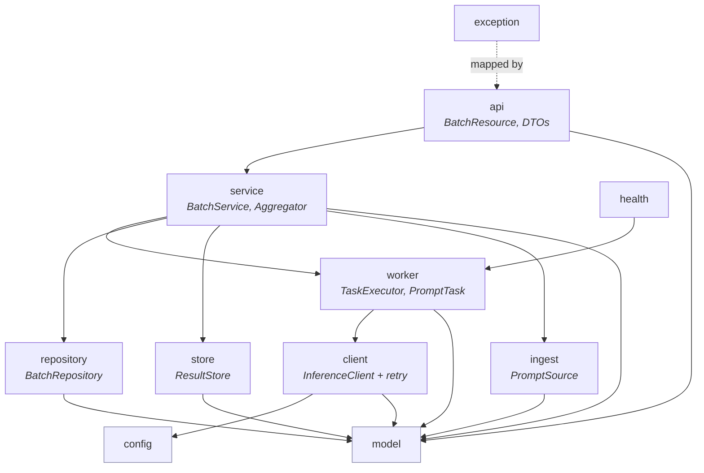
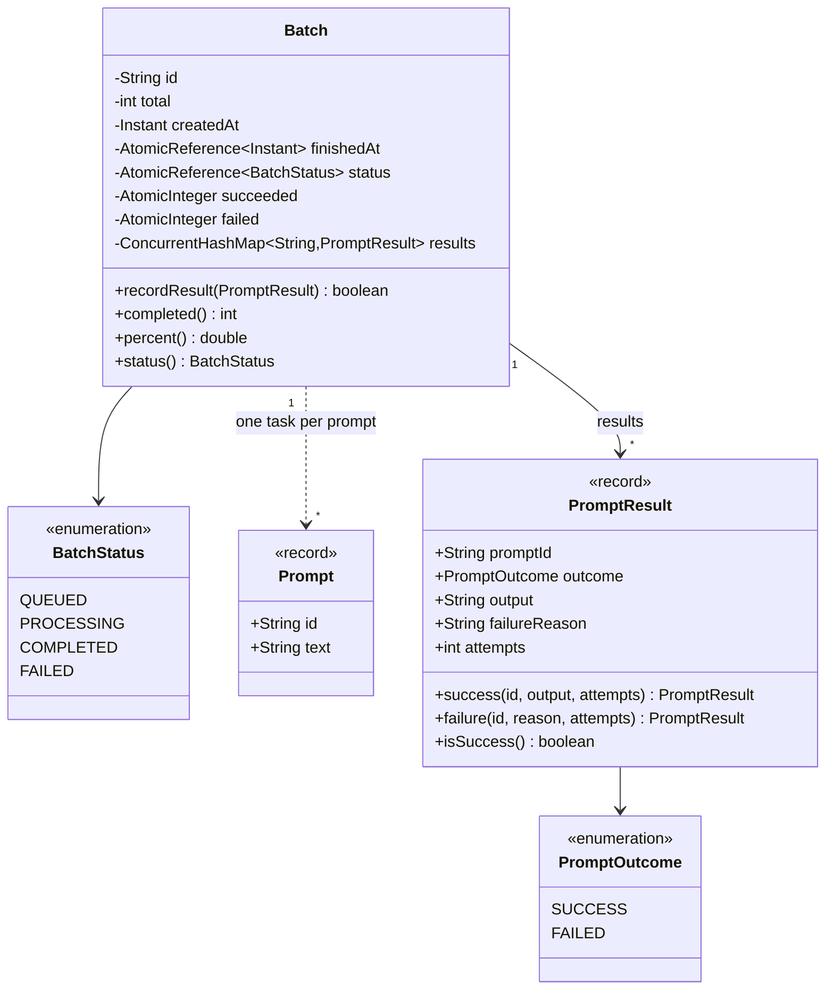
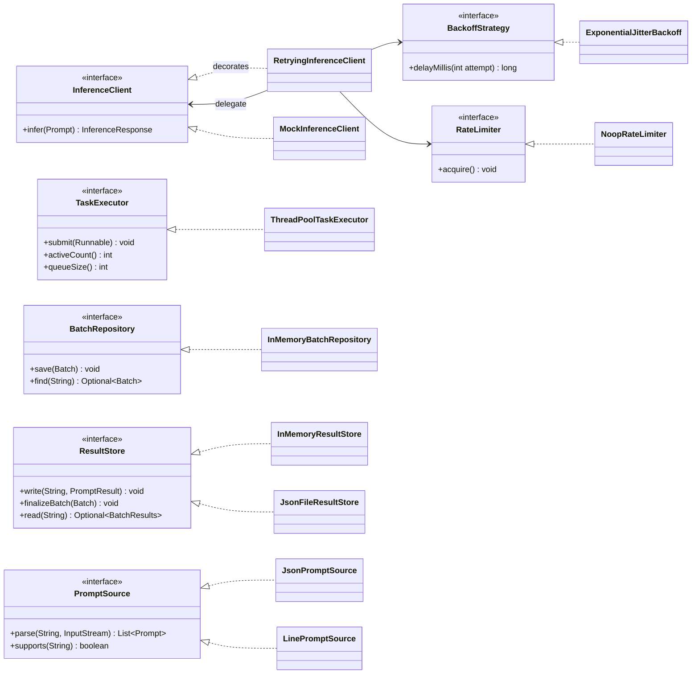
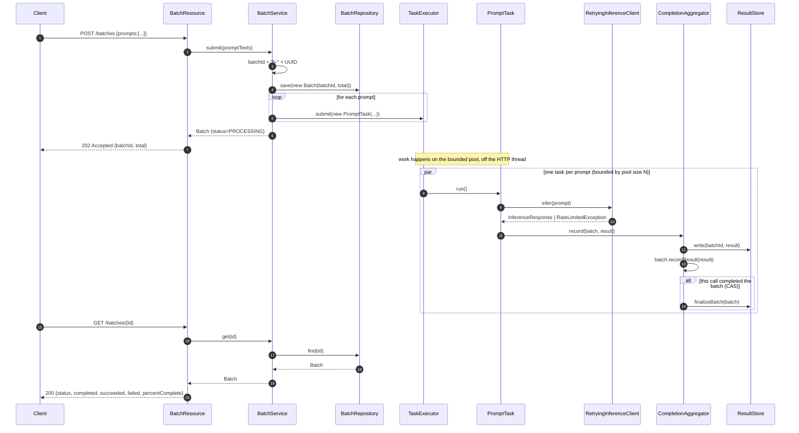
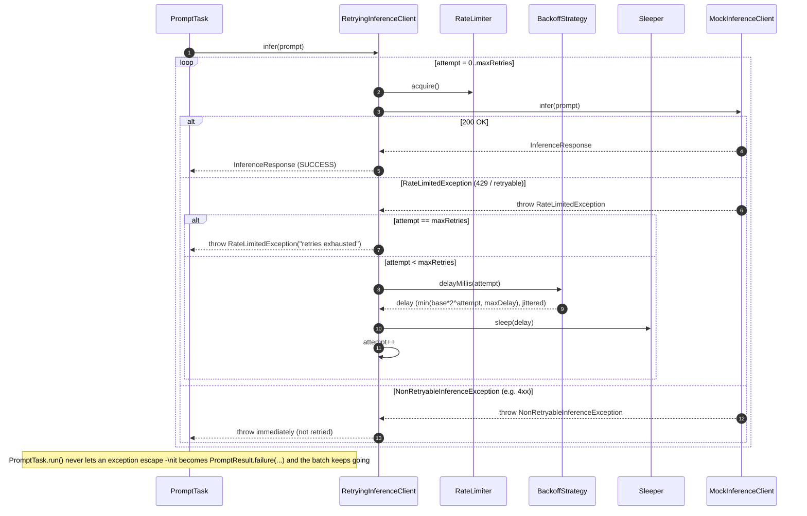
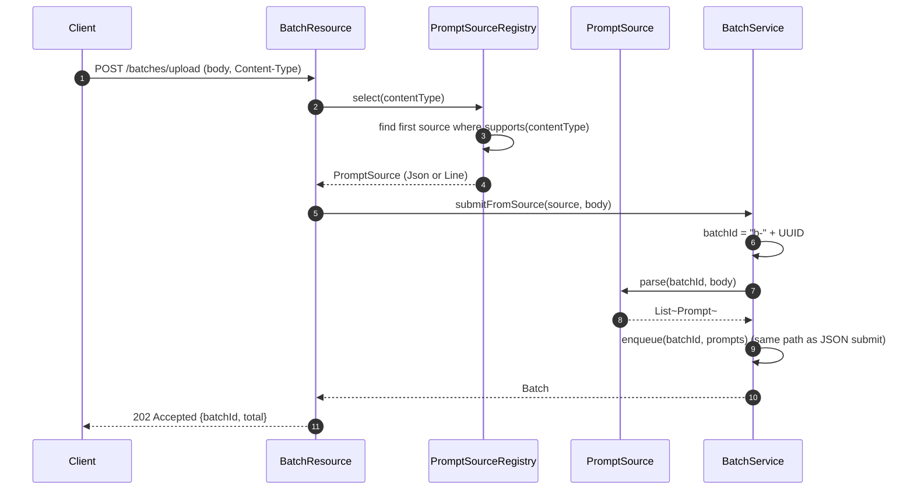
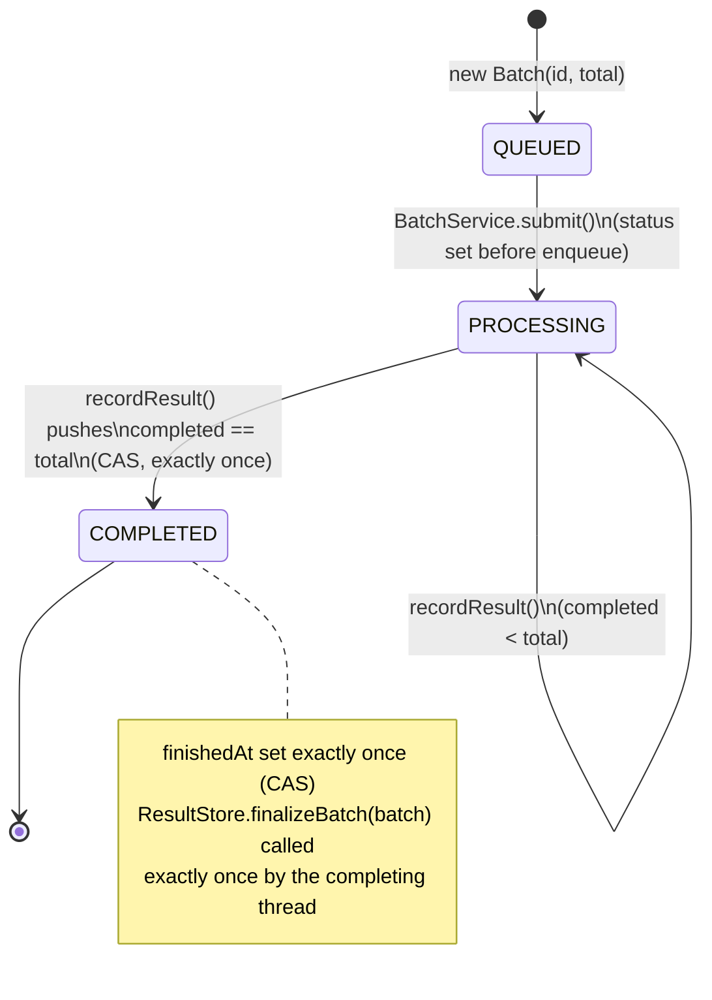
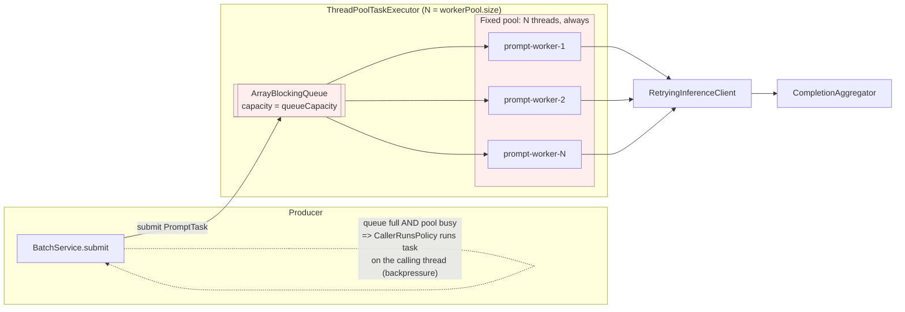
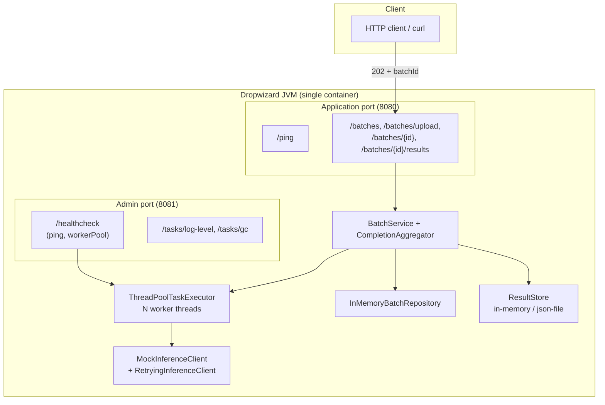

# LLD Diagrams — Prompt Batch Service

> **Purpose.** [`LLD.md`](LLD.md) describes the seams and contracts in prose; this document
> is the **visual companion**: every diagram here is drawn directly from the classes actually
> checked into `src/main/java/com/example/promptbatch` (not just the design intent), so you can
> use it as a map while reading the code.
>
> Render these with any Mermaid-compatible viewer (GitHub renders them natively).

## Table of contents

1. [Package / dependency diagram](#1-package--dependency-diagram)
2. [Class diagram — domain model](#2-class-diagram--domain-model)
3. [Class diagram — seams & implementations](#3-class-diagram--seams--implementations)
4. [Sequence — submit a batch (`POST /batches`)](#4-sequence--submit-a-batch-post-batches)
5. [Sequence — retry with backoff on `429`](#5-sequence--retry-with-backoff-on-429)
6. [Sequence — file upload (`POST /batches/upload`)](#6-sequence--file-upload-post-batchesupload)
7. [State diagram — `Batch` lifecycle](#7-state-diagram--batch-lifecycle)
8. [Concurrency diagram — bounded worker pool](#8-concurrency-diagram--bounded-worker-pool)
9. [Composition root — object graph](#9-composition-root--object-graph)
10. [Component diagram — runtime view](#10-component-diagram--runtime-view)

---

## 1. Package / dependency diagram

Dependencies point one way only: `api → service → {worker, repository, store, ingest} →
client → model/config`. Nothing depends on `api`, and `model`/`config` depend on nothing
internal.

---

## 2. Class diagram — domain model

`Batch` is the only shared *mutable* type; everything else is an immutable record.

**Invariant enforced in code (`Batch.recordResult`):** `completed() == succeeded() +
failed()` always, and the `PROCESSING → COMPLETED` transition is a `compareAndSet` — so
exactly one caller (across all worker threads) ever gets `true` back and is responsible for
finalizing the result store. This is unit-tested in `BatchTest` and
`CompletionAggregatorTest` with 500–1000 concurrent writers.

---

## 3. Class diagram — seams & implementations

The seven interfaces (seams) that make every layer swappable, and the v1 implementation
wired behind each one in `PromptBatchApplication.run(...)`.

---

## 4. Sequence — submit a batch (`POST /batches`)

Shows the async boundary in `BatchService.submit(...)`: the HTTP thread returns `202` before
any inference call happens.

---

## 5. Sequence — retry with backoff on `429`

Exactly what `RetryingInferenceClient.infer(...)` does, matching
`RetryingInferenceClientTest`.

---

## 6. Sequence — file upload (`POST /batches/upload`)

Shows the `ingest` seam: the resource never branches on content type itself, it delegates to
`PromptSourceRegistry`.

---

## 7. State diagram — `Batch` lifecycle

Enforced by `Batch.status` (an `AtomicReference<BatchStatus>`) — monotonic, no
back-transitions, `PROCESSING → COMPLETED` guarded by CAS so it fires exactly once.

---

## 8. Concurrency diagram — bounded worker pool

The producer–consumer boundary implemented by `ThreadPoolTaskExecutor`
(`corePoolSize == maxPoolSize`, bounded `ArrayBlockingQueue`, `CallerRunsPolicy`).

**Verified by `ThreadPoolTaskExecutorTest`:** submitting far more tasks than `N` never lets
observed in-flight concurrency exceed `N`, and all tasks still reach a terminal state even
when the queue is deliberately small (backpressure via `CallerRunsPolicy`, not drops).

---

## 9. Composition root — object graph

Everything below is wired in exactly one place: `PromptBatchApplication.run(...)`. This is
the only class that names concrete implementations.

```mermaid
flowchart TB
    CFG[PromptBatchConfiguration] --> APP[PromptBatchApplication.run]

    APP -->|new| REPO[InMemoryBatchRepository]
    APP -->|new, based on store.type| STORE[InMemoryResultStore\nor JsonFileResultStore]
    APP -->|new| AGG[CompletionAggregator]
    APP -->|new + env.lifecycle&#40;&#41;.manage| EXEC[ThreadPoolTaskExecutor]
    APP -->|new| RL[NoopRateLimiter]
    APP -->|new| BO[ExponentialJitterBackoff]
    APP -->|new| TRANSPORT[MockInferenceClient]
    APP -->|new, wraps transport| RIC[RetryingInferenceClient]
    APP -->|new| REG[PromptSourceRegistry\nJson + Line sources]
    APP -->|new| SVC[BatchService]
    APP -->|register| RES[BatchResource]
    APP -->|register| MAPPERS[Exception mappers]
    APP -->|register| HC[WorkerPoolHealthCheck]

    AGG --> STORE
    SVC --> REPO
    SVC --> EXEC
    SVC --> RIC
    SVC --> AGG
    RIC --> TRANSPORT
    RIC --> RL
    RIC --> BO
    RES --> SVC
    RES --> REG
    HC --> EXEC
```

---

## 10. Component diagram — runtime view

How the pieces map onto the running Dropwizard process and its two ports (matches
`config/config-*.yml`).

