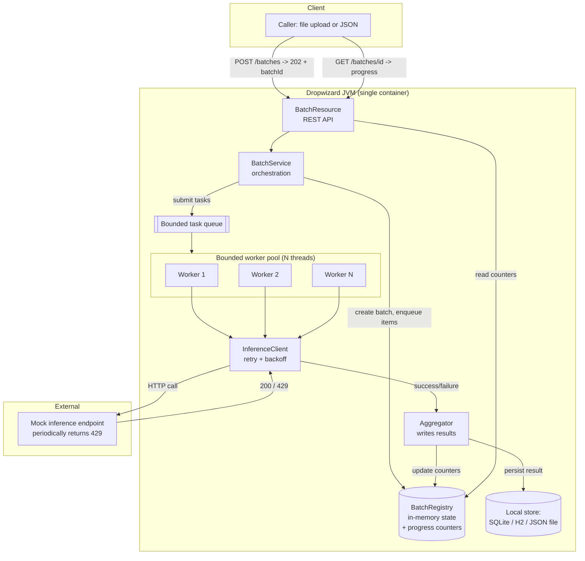
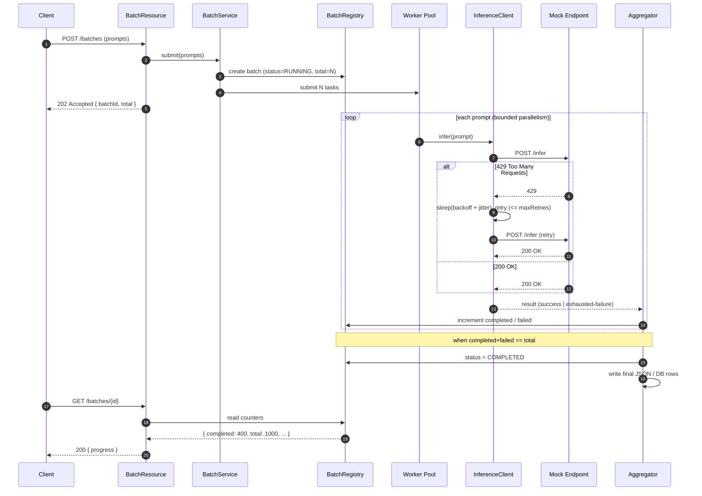
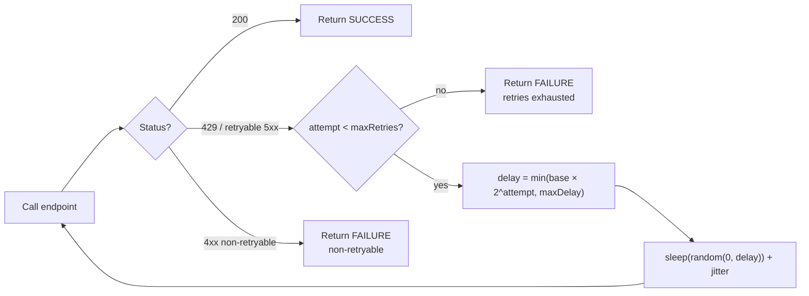
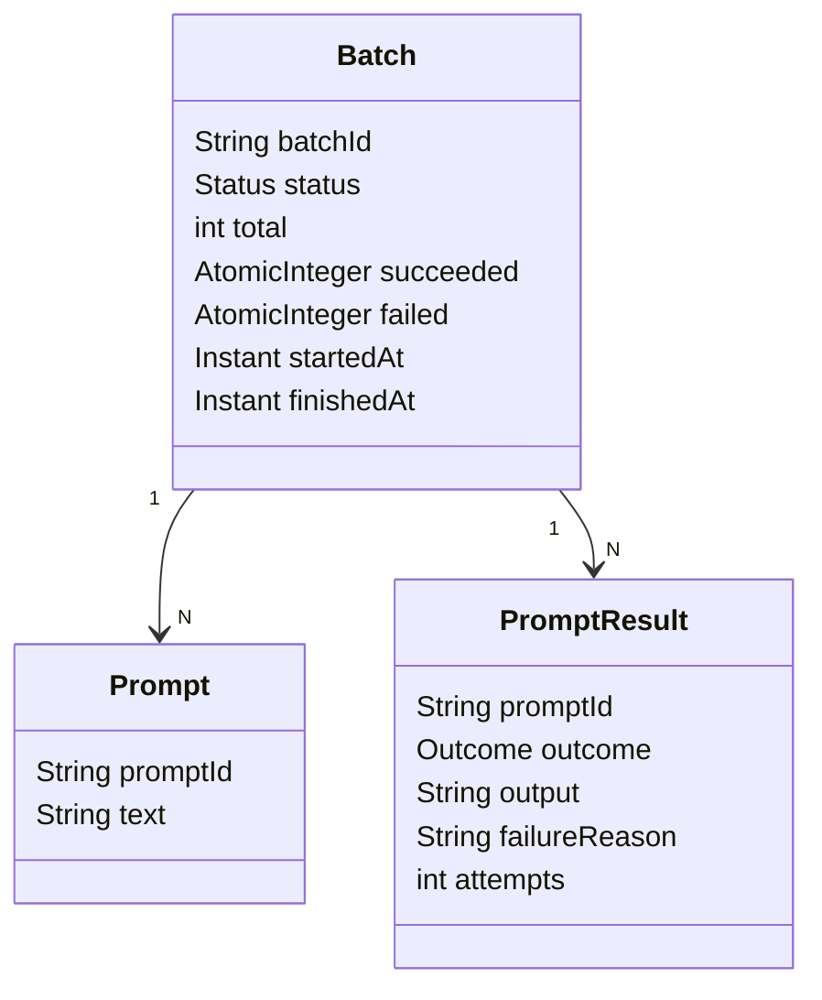
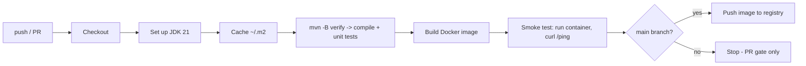
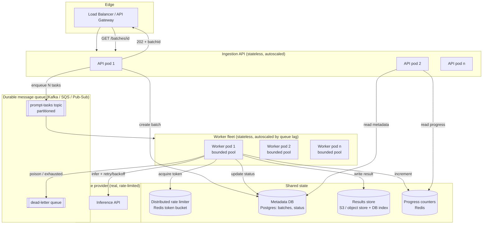
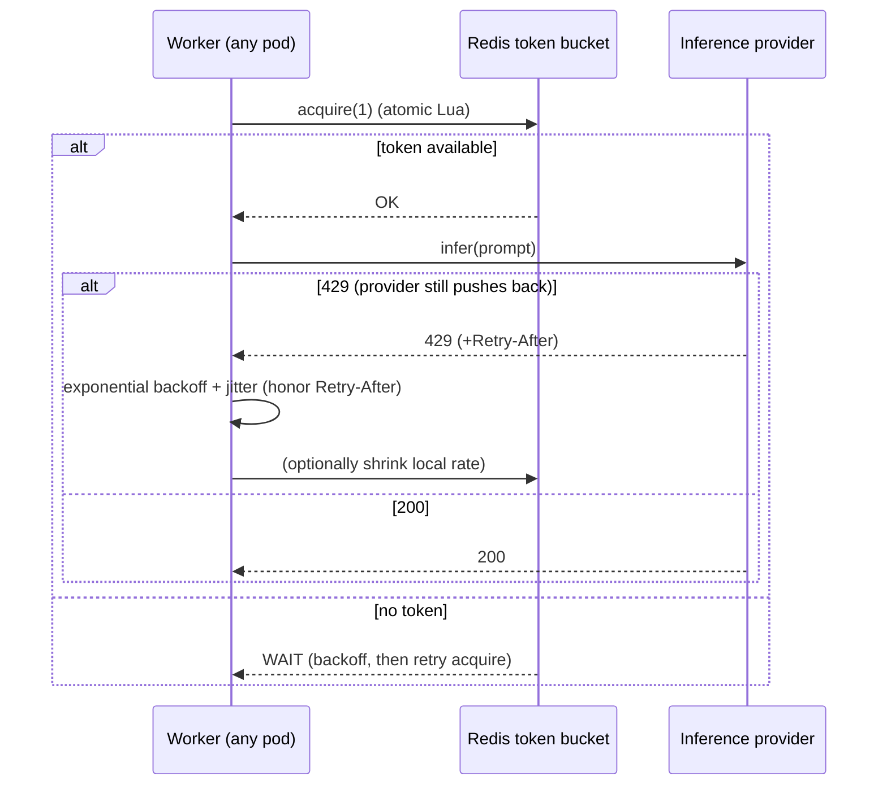

# Solutioning Document — Prompt Batch Service

> **Purpose.** This document explains *how the service works* end-to-end: the
> problem, the design of the **basic single-node solution** we are building on
> Java + Dropwizard + Docker, and a concrete, phased path to **scale it to ~10M
> users**. It is written to be read top-to-bottom by an engineer or reviewer who
> has never seen the repo before.
>
> **Companion docs:** [`LLD.md`](LLD.md) drills into the interfaces/seams and class-level
> contracts that make this design extensible; [`APPROACHES.md`](APPROACHES.md) records the
> alternatives we evaluated for each decision and why the chosen approach wins;
> [`DEVELOPMENT_GUIDE.md`](DEVELOPMENT_GUIDE.md) is the milestone-by-milestone build guide.

---

## Table of contents

1. [Problem statement](#1-problem-statement)
2. [Requirements (functional + non-functional)](#2-requirements)
3. [Key concepts & vocabulary](#3-key-concepts--vocabulary)
4. [Basic solution (v1, single node)](#4-basic-solution-v1-single-node)
   - [4.1 High-level architecture](#41-high-level-architecture)
   - [4.2 End-to-end request flow](#42-end-to-end-request-flow)
   - [4.3 The concurrency model (worker pool)](#43-the-concurrency-model-worker-pool)
   - [4.4 Rate-limit handling: retry + backoff](#44-rate-limit-handling-retry--backoff)
   - [4.5 Result aggregation & persistence](#45-result-aggregation--persistence)
   - [4.6 Progress tracking endpoint](#46-progress-tracking-endpoint)
   - [4.7 Data model](#47-data-model)
   - [4.8 API surface](#48-api-surface)
   - [4.9 Configuration](#49-configuration)
   - [4.10 Failure modes & how we handle them](#410-failure-modes--how-we-handle-them)
5. [Testing strategy](#5-testing-strategy)
6. [CI/CD](#6-cicd)
7. [Why v1 does *not* scale to 10M users](#7-why-v1-does-not-scale-to-10m-users)
8. [Scaling to 10M users (target architecture)](#8-scaling-to-10m-users-target-architecture)
   - [8.1 Capacity math (back-of-the-envelope)](#81-capacity-math-back-of-the-envelope)
   - [8.2 Target architecture](#82-target-architecture)
   - [8.3 Distributed concurrency & rate limiting](#83-distributed-concurrency--rate-limiting)
   - [8.4 State, storage & progress at scale](#84-state-storage--progress-at-scale)
   - [8.5 Delivery guarantees & idempotency](#85-delivery-guarantees--idempotency)
   - [8.6 Observability & operations](#86-observability--operations)
9. [Migration path (phases)](#9-migration-path-phases)
10. [Design decisions & trade-offs (summary)](#10-design-decisions--trade-offs-summary)

---

## 1. Problem statement

We need a backend service that:

- accepts a **batch of AI prompts** (e.g. up to ~1,000 items) via **file upload or a JSON API**,
- **acknowledges immediately** (does not block the caller while processing),
- processes the prompts **concurrently** against a **mock, rate-limited inference endpoint**,
- **survives rate limiting** (the mock endpoint periodically returns HTTP `429`) by
  **retrying with backoff** instead of dropping prompts,
- **aggregates** successful inferences into a **final JSON output** and/or a **local database**, and
- exposes **live progress** of an in-flight batch (e.g. `400 / 1000 completed`).

The interesting engineering is **not** the AI call itself (that is mocked) — it is the
**concurrency discipline**: bounded parallelism, backpressure, correct retry/backoff,
and accurate aggregation/progress under partial failure.

---

## 2. Requirements

### Functional

| # | Requirement |
|---|-------------|
| F1 | **Batch ingestion** — accept a batch of prompts via file upload or JSON API. |
| F2 | **Immediate acknowledgement** — return `202 Accepted` + a `batchId` right away; processing continues in the background. |
| F3 | **Concurrent processing** — process prompts across a **bounded** pool of workers, not strictly sequentially. |
| F4 | **Rate-limit handling** — on `429`, apply retry with backoff (+ jitter) so no prompt is dropped and the batch is not failed as a whole. |
| F5 | **Result aggregation** — compile successful inferences into a final JSON structure and/or persist to a local DB when the batch completes. |
| F6 | **Progress query** — an endpoint returning live progress (completed / failed / total). |

### Non-functional

| # | Requirement |
|---|-------------|
| N1 | **Bounded resource usage** — never spawn unbounded threads; the pool size is fixed/configurable. |
| N2 | **Backpressure** — ingestion must not let an unbounded amount of work pile up in memory. |
| N3 | **Resilience** — a few failing prompts must not fail the whole batch. |
| N4 | **Observability** — health checks, metrics, and structured logs. |
| N5 | **Reproducible run** — one command to build & run via Docker. |
| N6 | **Testability** — retry/backoff logic is unit-tested deterministically. |

---

## 3. Key concepts & vocabulary

- **Batch** — a submitted set of prompts, tracked by a unique `batchId`.
- **Prompt / item** — one unit of work (one inference call).
- **Worker pool** — a fixed-size `ExecutorService`; the number of threads = the max
  number of prompts being processed at any instant.
- **Inference client** — the component that calls the (mock) rate-limited endpoint.
- **Rate limit (`429`)** — "Too Many Requests"; the signal to slow down and retry later.
- **Backoff** — increasing the wait time between retries (here: exponential + jitter).
- **Aggregation** — collecting per-prompt outcomes into a batch-level result.
- **Backpressure** — bounding queued work so producers slow down when consumers are busy.

---

## 4. Basic solution (v1, single node)

The v1 goal is a **single Dropwizard process** that is *correct, bounded, and
observable* — the reference implementation of the concurrency model. Everything runs
in one JVM inside one Docker container. No external infra required.

### 4.1 High-level architecture



**Components:**

- **`BatchResource`** — Jersey REST resource. Accepts submissions, returns `202` +
  `batchId` immediately, and serves progress/result reads.
- **`BatchService`** — orchestrator. Creates the batch record, splits it into per-prompt
  tasks, and submits them to the worker pool. Returns before work finishes.
- **`BatchRegistry`** — in-memory source of truth for batch state and progress counters
  (`total`, `completed`, `failed`, `status`). Uses thread-safe structures.
- **Worker pool** — a fixed-size `ThreadPoolExecutor` with a **bounded** queue. This is
  the heart of the concurrency discipline (see §4.3).
- **`InferenceClient`** — wraps the call to the mock endpoint and implements
  **retry + exponential backoff + jitter** on `429` (see §4.4).
- **`Aggregator`** — records each prompt's outcome, updates counters, and on batch
  completion writes the final JSON / DB rows (see §4.5).
- **Local store** — SQLite/H2 or a JSON file for durable results (config-selectable).

### 4.2 End-to-end request flow



### 4.3 The concurrency model (worker pool)

This is the core of the assignment, so it gets the most detail.

**Goal:** process many prompts *in parallel* but with a **hard ceiling** on concurrency
so the app never exhausts CPU, memory, threads, or the downstream endpoint.

**Mechanism:** a single, shared, fixed-size `ThreadPoolExecutor`:

```java
// Illustrative — the shape of the pool we configure.
int poolSize = config.getWorkerPoolSize();            // e.g. 8
int queueCapacity = config.getQueueCapacity();        // e.g. 10_000

ThreadPoolExecutor pool = new ThreadPoolExecutor(
        poolSize, poolSize,                            // fixed: core == max
        0L, TimeUnit.MILLISECONDS,
        new ArrayBlockingQueue<>(queueCapacity),       // BOUNDED queue = backpressure
        new NamedThreadFactory("prompt-worker"),
        new ThreadPoolExecutor.CallerRunsPolicy());    // backpressure when queue is full
```

**Why this shape:**

- **`corePoolSize == maxPoolSize` (fixed N).** The number of live worker threads is
  capped at `N`. At most `N` prompts are ever in flight. This directly satisfies "worker
  pool size is limited so the application does not exhaust the system / spawn unbounded
  threads" (N1).
- **Bounded `ArrayBlockingQueue`.** Submitted-but-not-yet-started tasks are capped. We do
  **not** use an unbounded `LinkedBlockingQueue`, because that would let a huge batch (or
  many batches) accumulate millions of `Runnable`s and OOM the JVM (N2).
- **`CallerRunsPolicy` as the saturation policy.** When both the pool and the queue are
  full, the submitting thread runs the task itself. This throttles the *producer*
  (ingestion) instead of dropping work — natural backpressure that keeps the whole system
  bounded.
- **Named threads** for readable stack traces / logs / metrics.

**Sizing guidance.** The work is **I/O-bound** (network call to the inference endpoint),
not CPU-bound. So the useful pool size is governed by target throughput and latency, not
by core count:

```
N ≈ target_in_flight_requests
  ≈ (desired_throughput_rps) × (avg_request_latency_seconds)
```

Example: to keep ~50 requests in flight at ~200 ms each ≈ 250 rps. We keep `N` **below**
what the downstream rate limit tolerates, so the pool itself is a first line of rate
control. Pool size, queue capacity, and retry params are all in `config.yml` (§4.9), so
they can be tuned without a rebuild.

**Lifecycle.** The pool is created at startup and registered with Dropwizard's lifecycle
(`environment.lifecycle().manage(...)`) so it is **gracefully shut down** on stop
(`shutdown()` → await termination → `shutdownNow()`), letting in-flight prompts finish.

**Per-prompt task.** Each prompt is one `Runnable`/`Callable` that: calls the
`InferenceClient`, gets a success or an exhausted-failure, and reports the outcome to the
`Aggregator`. Tasks are **independent** — no shared mutable state except the thread-safe
registry counters — which keeps the model simple and lock-light.

### 4.4 Rate-limit handling: retry + backoff

The mock endpoint periodically returns `429`. A worker must **back off and retry**, not
drop the prompt and not fail the batch.

**Algorithm: bounded exponential backoff with full jitter.**

```
attempt = 0
while attempt <= maxRetries:
    response = call(prompt)
    if response.status == 200:
        return SUCCESS(response.body)
    if response.status == 429 (or retryable 5xx):
        if attempt == maxRetries:
            return FAILURE(exhausted)     # give up on THIS prompt only
        delay = min(baseDelay * 2^attempt, maxDelay)
        sleep(random(0, delay))           # full jitter (honor Retry-After if present)
        attempt += 1
        continue
    else:                                 # non-retryable (e.g. 400)
        return FAILURE(non-retryable)
```

**Design points:**

- **Exponential growth** (`base * 2^attempt`) quickly relieves pressure on an overloaded
  endpoint; **`maxDelay`** caps the wait so a prompt cannot hang forever.
- **Full jitter** (`random(0, delay)`) prevents the *thundering herd* — without it, many
  workers that hit `429` at the same instant would retry in lockstep and re-trigger the
  limit. Jitter spreads retries out.
- **`Retry-After` awareness** — if the endpoint returns that header, we prefer it over our
  computed delay.
- **Bounded retries** — after `maxRetries` we mark *that prompt* failed and move on. The
  batch keeps going (N3). Failures are recorded, not silently dropped.
- **The sleep happens on the worker thread**, which is why concurrency stays bounded: a
  backing-off worker occupies one of the `N` slots and naturally reduces the offered load
  on the endpoint. (At larger scale we would move this off-thread; see §8.3.)



### 4.5 Result aggregation & persistence

Each finished task reports a `PromptResult` (success + output, or failure + reason). The
`Aggregator`:

1. **Updates counters** in the registry atomically (`completed`, `failed`).
2. **Stores the per-prompt result** (in memory for v1, and/or streamed to the store).
3. **Detects completion** when `completed + failed == total`, flips batch `status` to
   `COMPLETED`, and writes the **final aggregated output**:

```json
{
  "batchId": "b-2f9c...",
  "status": "COMPLETED",
  "total": 1000,
  "succeeded": 987,
  "failed": 13,
  "startedAt": "2026-07-18T04:20:00Z",
  "finishedAt": "2026-07-18T04:21:12Z",
  "results": [
    { "promptId": "p-1", "status": "SUCCESS", "output": "..." },
    { "promptId": "p-2", "status": "FAILED", "reason": "rate-limit retries exhausted" }
  ]
}
```

**Persistence options (config-selectable):**
- **JSON file** per batch — simplest, matches "final JSON output".
- **Embedded DB (SQLite/H2)** — a `batches` table + a `prompt_results` table; better for
  querying and survives restarts.

For v1 either is fine; the interface (`ResultStore`) is abstracted so the backing store
can change without touching the workers.

### 4.6 Progress tracking endpoint

Because counters live in the thread-safe registry and are updated as each prompt finishes,
progress is a cheap read:

```
GET /batches/{id}
200 OK
{
  "batchId": "b-2f9c...",
  "status": "RUNNING",
  "total": 1000,
  "completed": 400,
  "succeeded": 392,
  "failed": 8,
  "percentComplete": 40.0
}
```

`completed = succeeded + failed`. Counters are `AtomicInteger`/`LongAdder`, so reads never
block workers and are always monotonic.

### 4.7 Data model



### 4.8 API surface

| Method | Path | Purpose | Response |
|--------|------|---------|----------|
| `POST` | `/batches` | Submit a batch as JSON `{ "prompts": ["...", "..."] }` | `202 { batchId, total }` |
| `POST` | `/batches/upload` | Submit a batch as a file (one prompt per line / JSON array) | `202 { batchId, total }` |
| `GET`  | `/batches/{id}` | Live progress | `200 { progress }` |
| `GET`  | `/batches/{id}/results` | Final aggregated results (when complete) | `200 { results }` / `409` if still running |
| `GET`  | `/ping` | Liveness | `200 { pong }` |
| `GET`  | `:8081/healthcheck` | Dropwizard health (admin port) | `200` |

`202 Accepted` (not `200`) is deliberate: it signals "accepted for async processing,"
which is exactly the immediate-ack requirement (F2).

### 4.9 Configuration

All concurrency/retry knobs are externalized to `config.yml` (env-overridable) so behavior
is tunable per environment without code changes:

```yaml
promptBatch:
  workerPoolSize: 8          # N — max prompts in flight
  queueCapacity: 10000       # bounded backlog (backpressure)
  retry:
    maxRetries: 5
    baseDelayMs: 100
    maxDelayMs: 5000
    jitter: true
  mockEndpoint:
    rateLimitProbability: 0.3   # how often the mock returns 429 (for demos/tests)
    baseLatencyMs: 150
  store:
    type: postgres             # postgres | json-file | in-memory
```

### 4.10 Failure modes & how we handle them

| Failure | Handling |
|---------|----------|
| Endpoint returns `429` | Retry with exponential backoff + jitter, bounded by `maxRetries` (§4.4). |
| Endpoint returns `5xx` | Treated as retryable (same path as `429`). |
| Endpoint returns `4xx` (bad request) | Non-retryable → prompt marked `FAILED`, batch continues. |
| A prompt exhausts retries | Recorded as `FAILED` with reason; **batch not failed** (N3). |
| Queue full (burst) | `CallerRunsPolicy` throttles the producer (backpressure, N2). |
| JVM/container restart | v1 in-memory state is lost for in-flight batches. **Known limitation** of v1 — addressed by durable queue + DB in §8. On a single node, [`LLD.md` §13](LLD.md#13-task-persistence--retry-in-memory-v1-db-swappable) already ships a per-task retry log (in-memory in v1, so it still doesn't survive a crash) that handles idle-time retry today and becomes crash-safe with a one-line swap to a durable backing — no other class changes. |
| Graceful shutdown | Managed lifecycle drains in-flight tasks before exit (§4.3). |

---

## 5. Testing strategy

The requirement calls out unit-testing the **retry/backoff** logic specifically.

- **Retry/backoff unit tests (core):** a mock `InferenceClient` transport that returns a
  scripted sequence (e.g. `429, 429, 200`). Assert that:
  - the call eventually **succeeds** after the scripted `429`s,
  - the number of **attempts** matches expectation,
  - **backoff grows** between attempts (inject a fake clock/`Sleeper` so tests are
    deterministic and fast — no real sleeping),
  - after `maxRetries` `429`s, the prompt is marked `FAILED` **and the batch is not
    failed** (a sibling prompt still succeeds).
- **Concurrency tests:** submit a batch larger than the pool; assert that observed
  in-flight concurrency never exceeds `workerPoolSize` (e.g. via a counting gate), and that
  all items reach a terminal state.
- **Aggregation tests:** given a mix of successes/failures, the final JSON counts and
  `status` transition (`RUNNING → COMPLETED`) are correct.
- **Resource/integration tests:** `DropwizardAppExtension` boots the app; `POST /batches`
  returns `202` + `batchId`; `GET /batches/{id}` reflects progress and eventual completion.
- **Deterministic time:** inject a `Sleeper`/`Clock` abstraction so backoff is verifiable
  without wall-clock flakiness.

> The current repo already ships JUnit 5 + AssertJ + Mockito and green tests for the
> skeleton; the above suite lands alongside each feature.

---

## 6. CI/CD

A **GitHub Actions** pipeline (`.github/workflows/ci.yml`) runs on every push/PR:



Stages: **build + test** (gates every PR) → **docker build** → **container smoke test** →
(on `main`) **publish image**. Fast feedback, reproducible, no local toolchain needed.

---

## 7. Why v1 does *not* scale to 10M users

v1 is correct and bounded, but it is deliberately **single-node** and **in-memory**. The
limits that break at scale:

| Limit in v1 | Why it breaks at 10M |
|-------------|----------------------|
| **State in JVM memory** (`BatchRegistry`) | One process = single point of failure; a restart loses in-flight batches; memory can't hold millions of batches. |
| **One worker pool in one process** | Throughput is capped by one machine's cores/NICs. Can't scale horizontally. |
| **Local file / embedded DB** | Not shared across instances; not durable/HA; contention. |
| **In-process queue** | Not durable; lost on crash; can't be consumed by other machines. |
| **Per-process retry/backoff only** | No *global* view of the downstream rate limit; N instances each backing off independently will still collectively overwhelm the endpoint. |
| **Sync backoff occupies a worker thread** | Fine at N=8; wasteful when you need tens of thousands of concurrent in-flight items. |
| **No autoscaling / load balancing** | Can't absorb 10M users' bursts. |

The good news: the v1 **interfaces** (`ResultStore`, `InferenceClient`, the task
abstraction, the registry) are the exact seams we swap out to scale — v1 is a faithful
single-node model of the same pipeline.

---

## 8. Scaling to 10M users (target architecture)

The core idea: **decouple ingestion from processing with a durable queue**, make the
**workers stateless and horizontally scalable**, move **state to shared datastores**, and
enforce a **global (distributed) rate limit**.

### 8.1 Capacity math (back-of-the-envelope)

Assume 10M users, each occasionally submitting batches. Illustrative targets:

- Say **1%** of users active per day submitting **1 batch of 1,000 prompts** ⇒
  `100,000 batches/day × 1,000 = 100M prompt-inferences/day`.
- `100M / 86,400 s ≈ ~1,160 inferences/sec average`, with peaks perhaps **5–10×** ⇒
  design for **~10k inferences/sec** peak.
- At ~200 ms/inference, in-flight concurrency needed ≈ `10,000 × 0.2 = ~2,000` concurrent
  calls — spread across many worker instances and *bounded by the downstream provider's
  rate limit*, which is usually the real ceiling.

Takeaways: (a) the **queue** must absorb 100M+ msgs/day durably; (b) throughput is almost
always **gated by the inference provider's rate limit**, so the distributed rate limiter
(and graceful backoff) is the most important scaling component, not raw compute.

### 8.2 Target architecture



**What changed vs v1, and why:**

| v1 component | Scales to | Why |
|--------------|-----------|-----|
| In-process task queue | **Durable partitioned queue** (Kafka/SQS/Pub-Sub) | Decouples ingest from processing; durable; consumable by many workers; natural buffering for bursts. |
| Single worker pool | **Fleet of stateless worker pods**, each still with a **bounded local pool** | Horizontal scale; the per-pod bounded pool from v1 is *reused verbatim* inside each pod. |
| `BatchRegistry` (memory) | **Postgres** (batch metadata/status) + **Redis** (hot progress counters) | Durable, queryable, shared across pods; Redis gives fast atomic `INCR` for progress. |
| Local file/embedded DB | **Object store (S3)** for result blobs + **DB index** | Cheap, durable, effectively unlimited; DB indexes for lookup. |
| Per-process backoff | **Distributed rate limiter** + per-pod backoff | Enforces a *global* cap so the whole fleet respects the provider's limit. |

The ingestion API becomes trivially stateless: validate → write batch row → publish one
message per prompt (or a chunked message) → return `202`. All heavy lifting is async.

### 8.3 Distributed concurrency & rate limiting

Two levels of bounding, mirroring v1 but globally coordinated:

1. **Per-pod bounded pool (unchanged from v1).** Each worker pod keeps a fixed-size
   `ThreadPoolExecutor` so no single pod exhausts itself. This is the *same code and same
   discipline* as §4.3 — it just runs in many replicas.
2. **Global rate limiter (new).** Before each inference call, a worker must **acquire a
   token** from a **distributed token bucket in Redis** (e.g. Lua script for atomic
   `take`, refilled at the provider's allowed rate). This guarantees that *all pods
   combined* never exceed the provider's limit — solving the "N instances each backing off
   independently still overload the endpoint" problem.



**Autoscaling.** Worker pods scale on **queue lag / backlog depth** (e.g. KEDA on Kafka
consumer lag or SQS `ApproximateNumberOfMessages`), not CPU — because the work is
I/O-bound and gated by the rate limiter. If the provider limit is the ceiling, adding pods
beyond that just lets them idle on the token bucket, so we scale to the *lag* and cap max
replicas.

**Backoff off the hot thread at scale.** Instead of `sleep()` holding a worker thread
during long backoffs, at scale we prefer **re-queueing with a visibility delay** (SQS
delay / Kafka retry-topic with delay) so a backing-off item frees the thread for other
work. Same retry semantics, far better thread utilization.

### 8.4 State, storage & progress at scale

- **Batch metadata & status** → **Postgres** (`batches` table). Handles millions of rows;
  supports queries like "my recent batches."
- **Progress counters** → **Redis** hashes with atomic `HINCRBY` for `completed` /
  `succeeded` / `failed`. `GET /batches/{id}` reads Redis (sub-ms), not the DB. Counters
  are periodically flushed to Postgres for durability.
- **Per-prompt results** → **object store (S3)**: one aggregated result object per batch
  (or partitioned files for huge batches), with a pointer stored in Postgres. Keeps the
  DB small and the "final JSON output" requirement intact (just at scale).
- **Completion detection** → when Redis `completed == total`, a worker (or a lightweight
  finalizer) flips status to `COMPLETED`, writes the aggregated object, and emits an event
  (webhook/notification) so clients don't have to poll.

### 8.5 Delivery guarantees & idempotency

At scale, "process each prompt exactly once, don't drop any" needs care:

- **At-least-once delivery** from the queue + **idempotent processing**: each prompt has a
  stable `promptId`; a worker checks/writes result keyed by `promptId` (conditional
  write / upsert) so a redelivered message doesn't double-count progress.
- **Dead-letter queue (DLQ)** for prompts that exhaust retries or are poison messages —
  they're captured (not lost) for inspection/replay, and counted as `FAILED` in progress.
- **Visibility timeouts** sized above worst-case processing (incl. backoff) so in-flight
  messages aren't redelivered prematurely.
- **Idempotent batch creation** via a client-supplied idempotency key to make retried
  submissions safe.

### 8.6 Observability & operations

- **Metrics** (Prometheus/Micrometer): inferences/sec, `429` rate, retry counts, backoff
  time, queue lag, in-flight concurrency, pool saturation, batch completion latency.
- **Tracing** (OpenTelemetry): batch → prompt → inference-call spans to debug tail latency.
- **Structured logs** with `batchId`/`promptId` correlation IDs.
- **Dashboards & alerts**: queue lag growing, DLQ non-empty, `429` spike, worker crash
  loop, Redis/DB saturation.
- **Health/readiness** probes for k8s; graceful drain on pod termination (the v1 managed
  lifecycle pattern, per pod).

---

## 9. Migration path (phases)

You don't jump from v1 to the full distributed system in one step. Each phase is
independently shippable and keeps the same public API.

| Phase | What you add | Unlocks |
|-------|--------------|---------|
| **P0 — v1 (this repo)** | Single Dropwizard node, bounded pool, retry/backoff, in-memory registry, local store, progress endpoint, tests, CI, Docker. | Correct concurrency model; demoable end-to-end. |
| **P1 — Durability on one node** | Swap in-memory store for Postgres; persist batch + results; recover status on restart. | Survives restarts; queryable history. |
| **P2 — Decouple with a queue** | Introduce Kafka/SQS between API and workers; run API and worker as separate deployables (each worker reuses the v1 bounded pool). | Horizontal worker scaling; burst buffering. |
| **P3 — Shared fast state** | Redis for progress counters; results to S3 with DB index. | Fast progress reads; unbounded result storage. |
| **P4 — Global rate limiting** | Redis token bucket + delay-requeue backoff; DLQ; idempotency keys. | Fleet respects provider limit; no dropped/duplicated prompts. |
| **P5 — Elastic ops** | Autoscale on queue lag (KEDA), full metrics/tracing/alerts, multi-AZ. | 10M-user scale, resilient & observable. |

Because P0's abstractions (`ResultStore`, `InferenceClient`, task submission, progress
counters) are interface-based, each phase is mostly an **implementation swap behind a
stable interface**, not a rewrite.

---

## 10. Design decisions & trade-offs (summary)

| Decision | Why | Trade-off / alternative |
|----------|-----|-------------------------|
| **Fixed-size `ThreadPoolExecutor` + bounded queue** | Hard cap on concurrency & memory; simple; satisfies "no unbounded threads." | Less elastic than virtual threads; sized manually. (Virtual threads still need a *semaphore* to bound downstream load.) |
| **`CallerRunsPolicy`** | Natural backpressure without dropping work. | Can slow the ingest thread under sustained overload (acceptable/desired). |
| **Exponential backoff + full jitter** | Relieves the endpoint, avoids thundering herd, bounded worst case. | Adds latency to individual prompts (correct trade for stability). |
| **`202 Accepted` + async processing** | Immediate acknowledgement (F2); decouples caller from work. | Client must poll (or later, get a webhook) for completion. |
| **In-memory state for v1** | Simplest correct single-node model; fast; zero infra. | Not durable/HA — deliberately deferred to P1/P3. |
| **Interfaces around store/client/queue** | Lets each scaling phase swap implementations without a rewrite. | Slight upfront abstraction cost. |
| **Queue-based decoupling at scale** | Durability, horizontal scale, burst absorption. | Operational complexity (a broker to run). |
| **Distributed token bucket (Redis)** | Global rate cap across the whole fleet. | Redis becomes a critical dependency (mitigate with HA + local fallback). |
| **Autoscale on queue lag, not CPU** | Work is I/O-bound and rate-gated; lag is the true signal. | Requires queue-aware autoscaler (KEDA). |

---

### TL;DR

- **v1 (what we build now):** one Dropwizard container. Ingest → `202` + `batchId` →
  **bounded worker pool** processes prompts concurrently → **retry with exponential
  backoff + jitter** on `429` → **aggregate** to JSON/DB → **progress endpoint**. Bounded,
  correct, tested, containerized.
- **10M users:** keep the exact same pipeline shape but **decouple with a durable queue**,
  run a **stateless autoscaling worker fleet** (each pod reusing the bounded pool), move
  **state to Postgres/Redis/S3**, and enforce a **global distributed rate limit** with
  DLQ + idempotency. Ship it in phases behind a stable API.
